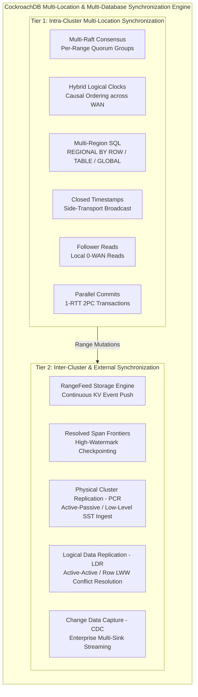
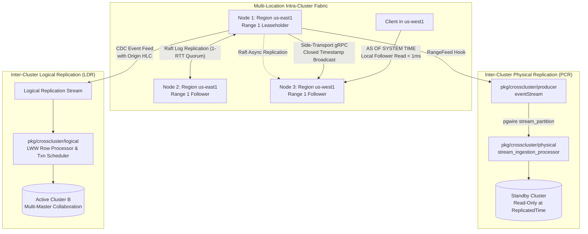

# CockroachDB Master Synchronization Architecture: Multi-Location & Multi-Database Systems

## 1. Executive Summary & Architectural Scope

CockroachDB is an industry-leading distributed SQL database engineered to deliver **Strict-Serializable ACID transactions** across geographically distributed infrastructure while offering multiple specialized mechanisms for multi-location and multi-database data synchronization.

When analyzing data synchronization across modern distributed topologies, CockroachDB solves two distinct architectural tiers:
1. **Intra-Cluster Multi-Location Synchronization**: Operating across nodes, availability zones, and cloud regions within a single unified database cluster.
2. **Inter-Cluster Multi-Database Synchronization**: Replicating data across autonomous, independently administered database clusters or external consumer systems.



---

## 2. Comprehensive Subsystem Comparison Matrix

The table below provides a rigorous comparative analysis of the four primary synchronization mechanisms provided by CockroachDB:

| Architectural Dimension | Multi-Region Intra-Cluster | Physical Cluster Replication (PCR) | Logical Data Replication (LDR) | Change Data Capture (CDC) |
| :--- | :--- | :--- | :--- | :--- |
| **Primary Purpose** | Single cluster spanning multiple cloud regions with regional data survivability. | Unidirectional cluster mirroring for Disaster Recovery (DR) and read-only offloading. | Bi-directional Active-Active multi-master replication between independent clusters. | Real-time event streaming to message brokers, search engines, and data lakes. |
| **Replication Layer** | Distributed Raft log entries & MVCC storage engine keys. | Low-level Key-Value pairs and Pebble SSTable byte blocks. | Logical SQL rows, column values, and transaction envelopes. | Encoded event envelopes (JSON, Avro, Protobuf). |
| **Consistency Model** | **Strict Serializable** ACID across all locations. | **Snapshot Consistent** at high-watermark `ReplicatedTime`. | **Causally Consistent** with Last-Write-Wins (LWW). | **At-least-once** with monotonic resolved timestamp frontiers. |
| **Conflict Resolution** | Single Leaseholder serialization + Concurrency Manager latches. | N/A (Standby cluster is strictly read-only). | **Last-Write-Wins (LWW)** using MVCC origin timestamps + DLQ fallback. | Delegated to downstream consumers. |
| **Read Latency** | $<2$ms (Local Leaseholder or Follower Read); $60$-$150$ms (Remote). | $<2$ms on standby cluster (`AS OF SYSTEM TIME ReplicatedTime`). | $<2$ms on local cluster (reads local data directly). | N/A (Streaming sink consumer). |
| **Write Latency** | $1$ Raft Quorum RTT ($<5$ms local, $60$-$100$ms cross-region). | Asynchronous ($RPO < 1$s; zero impact on primary write latency). | Asynchronous ($RPO < 1$s; local writes commit in $<5$ms). | Asynchronous ($RPO < 1$s; zero impact on transaction latency). |
| **Network Resilience** | Tolerates minority node failures; stalls if WAN partition isolates quorum. | Pull-based; consumer automatically resumes from persisted checkpoint. | Pull-based; bi-directional streams buffer and catch up independently. | Sink-buffered; resumes from durable high-watermark checkpoint. |
| **Primary Code Anchor** | [`pkg/ccl/multiregionccl`](file:///Users/bkoo/Documents/Development/GovTech/THKMesh/cockroach/pkg/ccl/multiregionccl), [`pkg/kv/kvserver`](file:///Users/bkoo/Documents/Development/GovTech/THKMesh/cockroach/pkg/kv/kvserver) | [`pkg/crosscluster/physical`](file:///Users/bkoo/Documents/Development/GovTech/THKMesh/cockroach/pkg/crosscluster/physical) | [`pkg/crosscluster/logical`](file:///Users/bkoo/Documents/Development/GovTech/THKMesh/cockroach/pkg/crosscluster/logical) | [`pkg/ccl/changefeedccl`](file:///Users/bkoo/Documents/Development/GovTech/THKMesh/cockroach/pkg/ccl/changefeedccl) |

---

## 3. High-Level Synchronization Architecture



---

## 4. Foundational Principles of CockroachDB Synchronization

### 4.1 Hybrid Logical Clocks (HLC)
Without dedicated GPS or atomic clocks (such as Google Spanner's TrueTime), CockroachDB utilizes Hybrid Logical Clocks ([`pkg/util/hlc/hlc.go`](file:///Users/bkoo/Documents/Development/GovTech/THKMesh/cockroach/pkg/util/hlc/hlc.go)). An HLC timestamp $T = \langle l, c \rangle$ contains:
- $l$: Physical component (maximum wall clock time observed).
- $c$: Logical counter (ticks whenever an event occurs within the same physical millisecond).

HLC ensures strict causality: if event $e_1$ causally precedes event $e_2$ ($e_1 \to e_2$), then $T(e_1) < T(e_2)$. Nodes maintain a cluster setting `max_offset` (typically $500$ms). If clock skew between any two nodes exceeds `max_offset`, the affected node self-terminates to prevent data corruption.

### 4.2 Multi-Raft Consensus
Rather than operating a single monolithic Raft consensus ring, CockroachDB divides data into millions of continuous key-value Ranges (typically $64$MB in size). Each Range is governed by an independent Raft consensus group ([`pkg/kv/kvserver/replica_raft.go`](file:///Users/bkoo/Documents/Development/GovTech/THKMesh/cockroach/pkg/kv/kvserver/replica_raft.go)):
- **Leaseholder**: Exactly one replica holds the Range Lease ([`pkg/kv/kvserver/leaseholder.go`](file:///Users/bkoo/Documents/Development/GovTech/THKMesh/cockroach/pkg/kv/kvserver/leaseholder.go)), directing all read and write proposals.
- **Heartbeat Coalescing**: Thousands of co-located ranges between the same physical nodes coalesce heartbeats into a single batch, preventing network saturation over WAN links.

### 4.3 Closed Timestamps & Follower Reads
To prevent cross-region WAN read round trips, the Leaseholder periodically closes timestamps ($T_{\text{closed}}$), guaranteeing that no future write will be accepted at $\le T_{\text{closed}}$ ([`pkg/kv/kvserver/closedts`](file:///Users/bkoo/Documents/Development/GovTech/THKMesh/cockroach/pkg/kv/kvserver/closedts)). 

A dedicated out-of-band side transport ([`pkg/kv/kvserver/closedts/sidetransport/sender.go`](file:///Users/bkoo/Documents/Development/GovTech/THKMesh/cockroach/pkg/kv/kvserver/closedts/sidetransport/sender.go)) broadcasts closed horizons to all cluster nodes. Follower replicas in remote regions can then serve historical queries (`AS OF SYSTEM TIME`) locally with sub-millisecond response times.

### 4.4 RangeFeeds & Resolved Span Frontiers
RangeFeeds ([`pkg/kv/kvclient/kvcoord/dist_sender_rangefeed.go`](file:///Users/bkoo/Documents/Development/GovTech/THKMesh/cockroach/pkg/kv/kvclient/kvcoord/dist_sender_rangefeed.go)) are low-level push listeners registered directly on Range replicas. 
- As mutations commit to the storage engine, RangeFeeds emit change events.
- Concurrently, the engine emits **Resolved Span** notifications indicating that all mutations up to timestamp $T$ for a given keyspan have been flushed.
- A frontier aggregator tracks the minimum resolved timestamp across all participating ranges, establishing an unbroken watermark of completeness.

---

## 5. Architectural Synthesis for THKMesh

The reverse engineering of CockroachDB yields four critical architectural lessons for the **THKMesh** telehealth deployment:

```
+---------------------------------------------------------------------------------------+
|                               THKMESH SYNTHESIS PRINCIPLES                            |
+---------------------------------------------------------------------------------------+
| 1. HYBRID TIMEKEEPING    | Edge kiosks generate HLC timestamps on all vital records to|
|                          | guarantee deterministic causal ordering over intermittent 4G|
| 2. BOUNDED-STALENESS     | Reference data (drugs, clinics) is served locally at kiosks |
|    FOLLOWER READS        | via closed timestamp caches, surviving WAN disconnects.    |
| 3. ASYNC PCR FOR DR      | Regional hospitals mirror critical databases to secondary  |
|                          | data centers using direct SST byte-stream ingestion.       |
| 4. ACTIVE-ACTIVE LDR     | Clinic-to-clinic collaboration uses LDR with LWW conflict  |
|    FOR MULTI-CLINIC      | resolution to prevent stale offline edits from corrupting  |
|    COLLABORATION         | live hospital electronic health records.                   |
+---------------------------------------------------------------------------------------+
```
