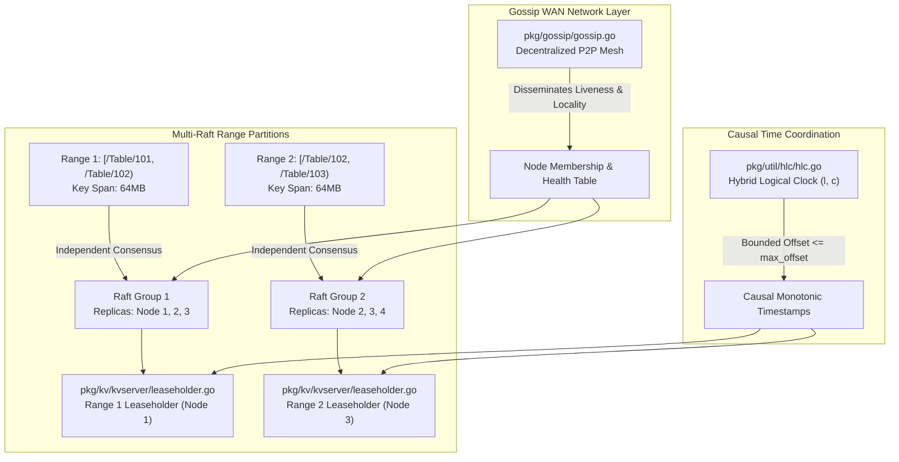
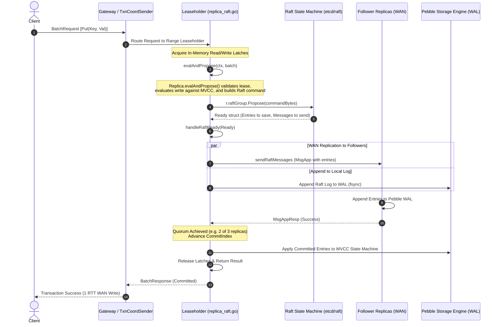
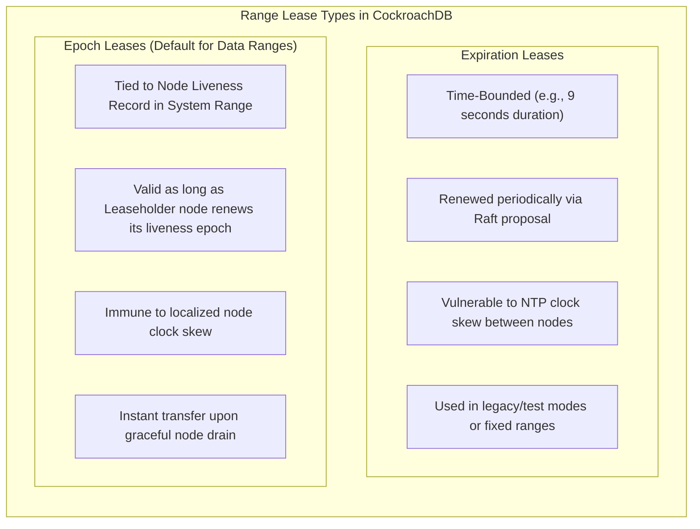
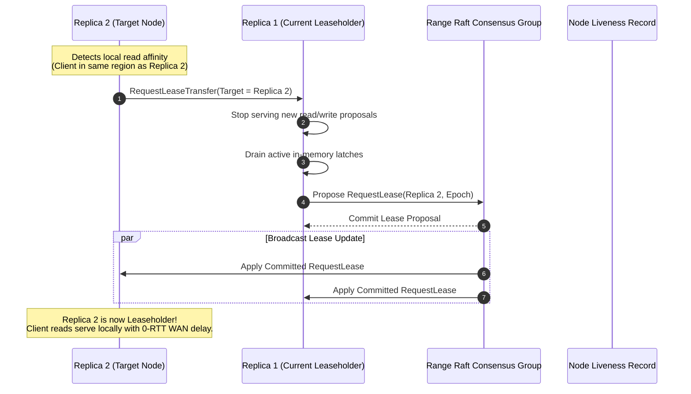
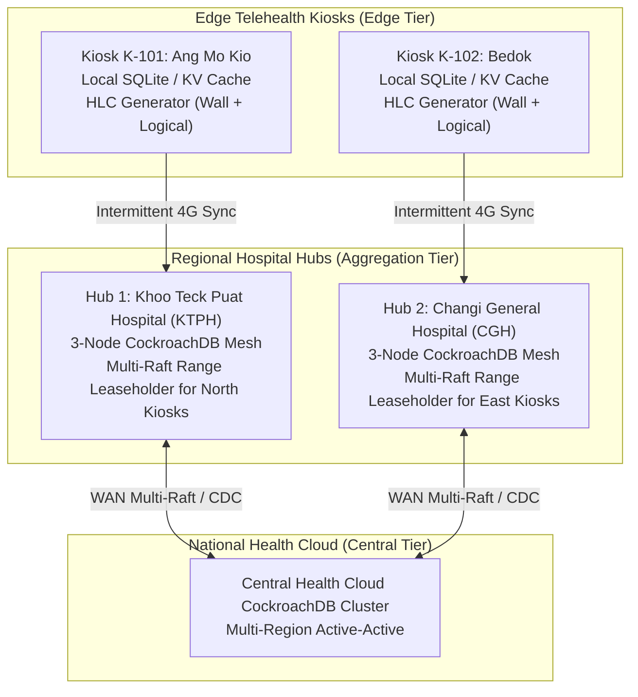

# CockroachDB Consensus & Topology Foundations: Multi-Raft, Range Leases, HLC, and Gossip

## 1. Executive Summary & Foundational Role in Synchronization

Data synchronization across a distributed database cluster requires solving three fundamental distributed systems problems:
1. **Durable Order & Quorum Consensus**: Guaranteeing that every replica in a replication group agrees on the identical linear sequence of mutations, even in the presence of machine crashes, network partitions, and message reordering.
2. **Read Authority & Split-Brain Prevention**: Eliminating the overhead of multi-node quorum round-trips for read operations without sacrificing linearizable consistency.
3. **Causal Timekeeping**: Establishing a strictly monotonic, causally consistent order of operations across disparate machines without relying on expensive, proprietary hardware atomic clocks or GPS receivers.

CockroachDB addresses these challenges through a synergistic four-pillar foundation:
- **Multi-Raft Consensus**: Instead of a single cluster-wide Raft log, data is split into thousands of continuous 64MB key spans (**Ranges**), each running an independent [etcd/raft](https://github.com/etcd-io/raft) consensus machine.
- **Range Leaseholders**: Exactly one replica per Range is granted an exclusive **Range Lease**, directing all read/write proposals and serving reads with zero Raft network round-trips.
- **Hybrid Logical Clocks (HLC)**: Combining physical wall-clock readings with logical monotonic counters to provide strict causal ordering bounded by a configurable `max_offset`.
- **Gossip WAN Network**: A decentralized, peer-to-peer anti-entropy mesh protocol that disseminates node liveness, capacity metrics, and multi-region topological localities.

---

## 2. Multi-Raft Consensus per Range Engine

### 2.1 Range Splitting & Independent Consensus Groups
In monolithic consensus systems (e.g., standard etcd), all cluster transactions pass through a single Raft leader, creating a hard write bottleneck of approximately 10,000 to 50,000 ops/sec. CockroachDB overcomes this through **Multi-Raft**:
- The total keyspace is partitioned into contiguous chunks called **Ranges** (default 64MB).
- Each Range has its own set of replicas (typically 3 or 5) configured via zone configs.
- Replicas communicate via an embed of the standard [etcd/raft](https://github.com/etcd-io/raft) state machine implementation.
- Different Ranges operate completely in parallel: Range 1 can commit writes while Range 2 is electing a new leader.

### 2.2 Proposal Evaluation & Execution Pipeline
When a write request arrives at the Range Leaseholder, it passes through the execution pipeline in [`pkg/kv/kvserver/replica_raft.go`](file:///Users/bkoo/Documents/Development/GovTech/THKMesh/cockroach/pkg/kv/kvserver/replica_raft.go):

Key Go source anchors in [`pkg/kv/kvserver/replica_raft.go`](file:///Users/bkoo/Documents/Development/GovTech/THKMesh/cockroach/pkg/kv/kvserver/replica_raft.go):
- **`evalAndPropose`** ([`replica_raft.go:L116`](file:///Users/bkoo/Documents/Development/GovTech/THKMesh/cockroach/pkg/kv/kvserver/replica_raft.go#L116)): Prepares pending command struct, consumes proposal quota, evaluates the command against the range's current storage state, and invokes `r.proposePendingCmdRaftMuLocked`.
- **`handleRaftReady`** ([`replica_raft.go:L867`](file:///Users/bkoo/Documents/Development/GovTech/THKMesh/cockroach/pkg/kv/kvserver/replica_raft.go#L867)) and **`handleRaftReadyRaftMuLocked`** ([`replica_raft.go:L889`](file:///Users/bkoo/Documents/Development/GovTech/THKMesh/cockroach/pkg/kv/kvserver/replica_raft.go#L889)): Extracts the `raft.Ready` bundle:
  1. Writes uncommitted `Ready.Entries` to Pebble WAL.
  2. Transmits outgoing `Ready.Messages` (`MsgApp`, `MsgVote`) via gRPC transport.
  3. Commits `Ready.CommittedEntries` by executing them against the storage engine state machine.
  4. Triggers `r.raftGroup.Advance()`.

### 2.3 Heartbeat Coalescing Across Thousands of Ranges
If a node hosts 20,000 range replicas, sending individual Raft heartbeats every 100ms would flood WAN links with 200,000 messages per second.
CockroachDB solves this with **Heartbeat Coalescing**:
- Implemented in [`replica_raft.go:L1759`](file:///Users/bkoo/Documents/Development/GovTech/THKMesh/cockroach/pkg/kv/kvserver/replica_raft.go#L1759) via `maybeCoalesceHeartbeat`.
- Replicas on Node A that need to send heartbeats to Node B queue their intent in a shared per-node transport channel.
- A single coalesced heartbeat message is sent periodically between Node A and Node B, containing an array of `(RangeID, CommitIndex)` tuples.
- This compresses network overhead by over **98%**, allowing clusters to scale to millions of ranges without heartbeat saturation.

### 2.4 Dynamic Membership via Joint Consensus
Range rebalancing, node decommissioning, and replica additions use Raft **Joint Consensus**:
- To change replica set from $C_{\text{old}}$ to $C_{\text{new}}$, the leader proposes a joint configuration $C_{\text{old,new}}$.
- Any configuration decision during joint consensus requires separate majorities from **both** $C_{\text{old}}$ and $C_{\text{new}}$.
- Once $C_{\text{old,new}}$ is committed, the leader proposes $C_{\text{new}}$, completing the transition safely without vulnerability to split-brain.

---

## 3. Range Leaseholder Coordination Architecture

In standard Raft, read operations must either:
1. Pass through the Raft log (costing 1 quorum RTT for every read), or
2. Send heartbeat round-trips to a majority of followers ("ReadIndex" protocol) to verify the leader hasn't been deposed.

CockroachDB separates the **Raft Leader** from the **Range Leaseholder**:
- The **Range Leaseholder** is granted exclusive authority to serve reads and evaluate writes for a given time window or epoch.
- All client requests are routed directly to the Leaseholder.
- Reads are served immediately from local Pebble storage at the specified MVCC timestamp with **0 network round trips**.

### 3.1 Lease Acquisition and Transfer Sequence
Lease operations are implemented in [`pkg/kv/kvserver/leaseholder.go`](file:///Users/bkoo/Documents/Development/GovTech/THKMesh/cockroach/pkg/kv/kvserver/leaseholder.go) and [`pkg/kv/kvserver/replica_lease.go`](file:///Users/bkoo/Documents/Development/GovTech/THKMesh/cockroach/pkg/kv/kvserver/replica_lease.go):

---

## 4. Hybrid Logical Clocks (HLC) & Distributed Time Synchronization

### 4.1 The Fundamental Time Challenge
Without specialized atomic clocks or GPS receivers (such as Google Spanner's TrueTime), distributed databases cannot rely purely on physical wall-clock time due to NTP drift, leap seconds, and network jitter. Conversely, purely logical clocks (Lamport timestamps) lack any correlation to physical wall-clock time, making historical time queries (`AS OF SYSTEM TIME '2026-09-28 08:00:00'`) impossible.

CockroachDB solves this with **Hybrid Logical Clocks (HLC)** ([`pkg/util/hlc/hlc.go`](file:///Users/bkoo/Documents/Development/GovTech/THKMesh/cockroach/pkg/util/hlc/hlc.go)), implementing the Kulkarni et al. algorithm.

### 4.2 HLC Timestamp Structure
An HLC timestamp consists of a physical component and a logical counter:
$$T = \langle l, c \rangle$$
- $l$: Physical component representing the highest physical wall-clock time (in nanoseconds) observed by the node or received in incoming messages.
- $c$: Logical counter incremented when events occur within the same physical millisecond.

### 4.3 Causal Ordering & Update Invariants
When Node A receives a message from Node B with timestamp $T_{\text{msg}} = \langle l_{\text{msg}}, c_{\text{msg}} \rangle$, it invokes `Clock.Update` ([`pkg/util/hlc/hlc.go:L471`](file:///Users/bkoo/Documents/Development/GovTech/THKMesh/cockroach/pkg/util/hlc/hlc.go#L471)):

$$\begin{aligned}
l' &= \max(l_{\text{current}}, \text{physical\_now}(), l_{\text{msg}}) \\
c' &= \begin{cases}
c_{\text{current}} + 1 & \text{if } l' = l_{\text{current}} \text{ and } l' = l_{\text{msg}} \text{ and } c_{\text{msg}} \le c_{\text{current}} \\
c_{\text{msg}} + 1 & \text{if } l' = l_{\text{msg}} \text{ and } l' > l_{\text{current}} \\
0 & \text{if } l' > l_{\text{current}} \text{ and } l' > l_{\text{msg}}
\end{cases}
\end{aligned}$$

### 4.4 Bounded Clock Offset & Safety Bounds
In [`pkg/util/hlc/hlc.go:L517`](file:///Users/bkoo/Documents/Development/GovTech/THKMesh/cockroach/pkg/util/hlc/hlc.go#L517), `UpdateAndCheckMaxOffset` enforces:
$$l_{\text{msg}} - \text{physical\_now}() \le \text{max\_offset}$$
- Default `max_offset`: **500ms**.
- If a received timestamp is ahead of the local physical clock by more than `max_offset`, or if physical clock jump is detected, CockroachDB raises a fatal error and **crashes the node immediately**.
- This crash prevents the node from violating linearizable read-after-write consistency.

---

## 5. Gossip Network & Distributed Cluster Topology

Nodes discover cluster topology, monitor node liveness, and propagate multi-region locality metadata through a decentralized **Gossip Protocol** ([`pkg/gossip/gossip.go`](file:///Users/bkoo/Documents/Development/GovTech/THKMesh/cockroach/pkg/gossip/gossip.go)):
- **Topology**: Ad-hoc peer-to-peer overlay network where each node maintains connections to $O(\sqrt{N})$ peers.
- **Dissemination**: Cyclic anti-entropy exchange with delta-based information compression.
- **Disseminated Metadata**:
  - Node descriptors (IP, port, hardware locality: `region=ap-southeast-1,zone=1a`).
  - Node liveness status and epoch counter.
  - Store capacity, available disk bytes, and range count.
  - Cluster settings and schema descriptors.

---

## 6. Comprehensive Architectural Comparison Matrix

| Architectural Feature | CockroachDB Multi-Raft | Monolithic Raft (etcd) | Google Spanner | Apache Cassandra |
| :--- | :--- | :--- | :--- | :--- |
| **Consensus Partitioning** | Multi-Raft per 64MB Range | Single Monolithic Log | Paxos Groups per Split | Masterless Quorum (No Raft) |
| **Max Concurrent Write Throughput** | Millions of ranges in parallel ($>10^6$ ops/sec) | Stalls on single leader ($\approx 3 \times 10^4$ ops/sec) | Millions of Paxos groups ($>10^6$ ops/sec) | Highly parallel ($>10^6$ ops/sec) |
| **Read Latency** | **0 RTT** (Local Leaseholder) | 1 RTT (Raft Log or ReadIndex) | 0 RTT (Paxos Leader with TrueTime) | Configurable (`LOCAL_QUORUM`, $1$ RTT) |
| **Clock Synchronization Requirement** | Software NTP ($\le 500$ms bounded HLC offset) | None (pure logical index) | Hardware Atomic Clocks + GPS ($\le 7$ms TrueTime) | Wall clock (vulnerable to NTP clock skew anomalies) |
| **Membership Changes** | Joint Consensus (zero downtime) | Single-node joint or phased | Paxos re-configuration | Ring token reassignment |
| **Network Scaling over WAN** | Coalesced heartbeats; heartbeat ticks over gRPC | Monolithic heartbeats | Hardware lease renewals | Gossip anti-entropy |
| **Consistency Level** | **Strict Serializable** ACID | Linearizable Key-Value | Strict Serializable ACID | Eventual / Tunable Consistency |

---

## 7. THKMesh Telehealth Kiosk Mesh Translation

Applying CockroachDB's consensus and topology foundations to the **THKMesh** (GovTech Telehealth Kiosk Mesh) deployment yields key implementation patterns:

### Direct Technical Mappings:
1. **Clinic-Level Multi-Raft**: Edge kiosks should not participate in a single global consensus ring. Instead, group kiosks into localized regional Multi-Raft clusters (3 nodes per regional polyclinic/hospital hub). This isolates cellular WAN disruptions to the local hub.
2. **Epoch Leases for Intermittent Connectivity**: Expiration leases cause read stalls whenever cellular latency spikes. Implementing epoch-based leases tied to hub node liveness allows edge kiosks to read patient history and triage algorithms offline.
3. **Prescription Causality via HLC**: When doctors issue digital prescriptions across different kiosks during power brownouts, local HLC timestamps ensure that order of prescription cancellation and creation is mathematically preserved without needing atomic clock hardware.
4. **Heartbeat Coalescing on Cellular Radios**: Coalesced heartbeats prevent 4G/5G radio interfaces on edge kiosks from remaining in high-power active states, extending battery backup runtime during grid outages.
