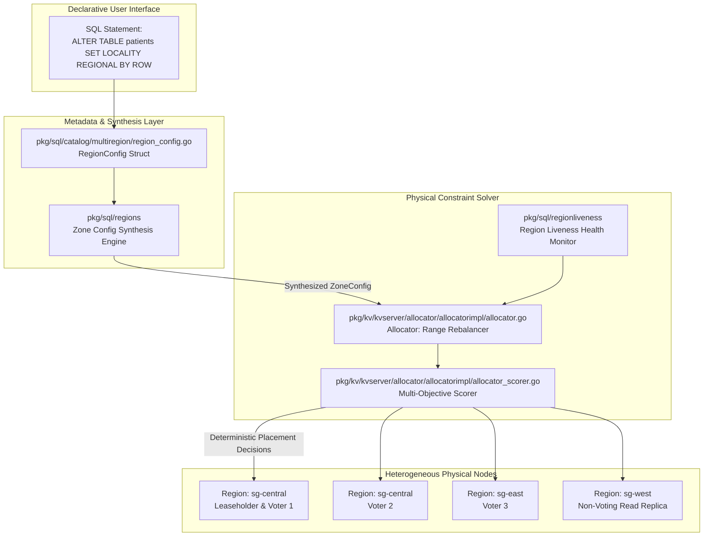
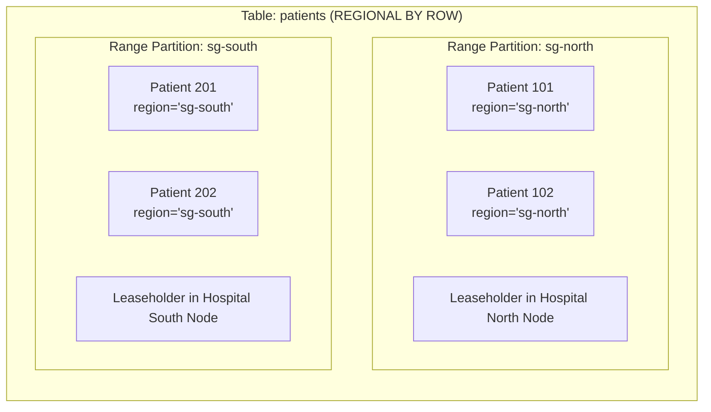
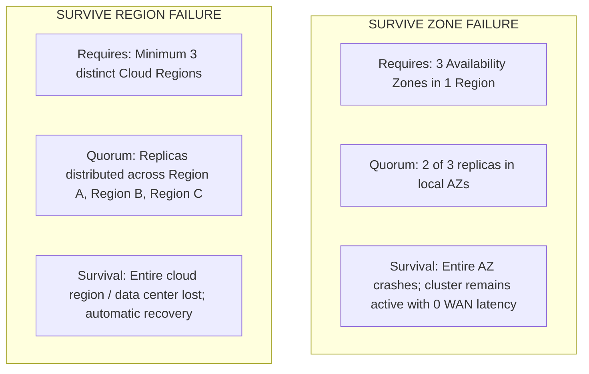

# Multi-Region SQL Topologies & Constraint-Based Placement

## 1. Executive Summary & Purpose

CockroachDB's Multi-Region architecture allows a single distributed SQL database cluster to span multiple geographic cloud regions, data centers, and availability zones while maintaining strict serializability. 

Rather than requiring database administrators to manually partition tables, configure replication zones, and write complex application routing logic, CockroachDB introduces high-level **declarative SQL locality abstractions**:
- `REGIONAL BY TABLE`
- `REGIONAL BY ROW`
- `GLOBAL TABLES`
- `SURVIVE {ZONE|REGION} FAILURE`

Under the hood, these abstractions compile into low-level zone configurations that the **Store Allocator** uses to continuously balance replicas across physical infrastructure based on latency, failure domains, and hardware capacity.

---

## 2. Multi-Region Architecture & Compilation Pipeline



---

## 3. Deep Dive: Table Locality Patterns

### 3.1 REGIONAL BY TABLE
- **Behavior**: All data ranges and the Range Leaseholder reside entirely within the database's primary region.
- **Latency Profile**:
  - Primary Region: Reads $<2$ms, Writes $<5$ms (purely local Raft consensus).
  - Remote Regions: Reads incur $1$ WAN RTT ($50-150$ms); Writes incur $1-2$ WAN RTTs.
- **Best Suited For**: Tables primarily accessed by centralized staff, back-office administration, and global audit logging.

### 3.2 REGIONAL BY ROW (Location-Pinned Data)
- **Behavior**: The table is partitioned by region using an automatic or explicit column (`crdb_region`).
- **Internal Mechanics**:
  - CockroachDB splits the table's key space into independent Range partitions:
    $$\text{Span}_{\text{north}} = [\text{"north"}, \dots), \quad \text{Span}_{\text{south}} = [\text{"south"}, \dots)$$
  - Each partition has its own ZoneConfig generated by `pkg/sql/regions`.
  - The Leaseholder and majority of voting replicas for the "north" partition are placed exclusively on nodes with `--locality=region=north`.
- **Latency Profile**:
  - Local Reads: $<2$ms from any region for its own local rows!
  - Local Writes: $<5$ms from any region (consensus is achieved among local nodes)!
- **Best Suited For**: Patient medical charts, clinic consultations, and local pharmacy dispensing.



### 3.3 GLOBAL TABLES (Read-Everywhere Optimization)
- **Behavior**: Optimized for tables that are read frequently from every location, but updated rarely.
- **Internal Mechanics**:
  - Voting replicas are distributed across regions to satisfy survival goals.
  - Generates non-voting or voting replicas in every live cluster region.
  - Utilizes extended **Closed Timestamps**: the leaseholder artificially lags closed timestamps by an interval greater than the max clock offset.
- **Latency Profile**:
  - Reads: **Sub-millisecond local reads in every single region** without touching the network!
  - Writes: Higher latency ($100-300$ms), as writes must coordinate across distant regions.
- **Best Suited For**: National drug formularies, clinical diagnostic codes (ICD-10), postal code mappings.

---

## 4. Survivability Goals: Zone vs. Region Survival

CockroachDB's multi-region catalog allows operators to declare survivability requirements:

```sql
ALTER DATABASE telehealth SURVIVE REGION FAILURE;
```



The metadata engine ([`pkg/sql/catalog/multiregion/region_config.go`](file:///Users/bkoo/Documents/Development/GovTech/THKMesh/cockroach/pkg/sql/catalog/multiregion/region_config.go)) calculates the exact replica count, voter constraints, and lease preferences required:
- `ZONE SURVIVAL`: Generates constraints targeting distinct zones within the primary region.
- `REGION SURVIVAL`: Synthesizes cross-region placement rules ensuring no single region holds a Raft quorum majority.

---

## 5. The Allocator Constraint Solver (`allocator.go`)

The Allocator ([`pkg/kv/kvserver/allocator/allocatorimpl/allocator.go`](file:///Users/bkoo/Documents/Development/GovTech/THKMesh/cockroach/pkg/kv/kvserver/allocator/allocatorimpl/allocator.go#L626)) runs as a continuous background control loop on every node. 

### Multi-Objective Scoring Function
When a range violates its locality rules or becomes unbalanced, `allocator_scorer.go` evaluates prospective stores using a weighted objective function:

$$\text{Score}(S) = w_{\text{constraint}} \cdot C(S) + w_{\text{diversity}} \cdot D(S) + w_{\text{balance}} \cdot B(S) + w_{\text{latency}} \cdot L(S)$$

Where:
- $C(S)$ (**Constraint Match**): Strict binary or tiered score evaluating whether store $S$ satisfies required and prohibited locality attributes (`+region=sg-north`).
- $D(S)$ (**Diversity Score**): Rewards placing replicas across diverse failure domains (different rack, datacenter, zone).
- $B(S)$ (**Capacity Balance**): Penalizes stores with high disk utilization or high range count.
- $L(S)$ (**Leaseholder Latency Match**): Prioritizes placing the leaseholder on the node receiving the highest query traffic for that range.

---

## 6. THKMesh Engineering Relevance & Practical Translation

```
+---------------------------------------------------------------------------------------+
|                             THKMESH TOPOLOGY BLUEPRINT                                |
+---------------------------------------------------------------------------------------+
| Table Type          | Locality Strategy   | Target Hardware Node                      |
+---------------------+---------------------+-------------------------------------------+
| Patient Vitals      | REGIONAL BY ROW     | Local Regional Hospital Hub Cluster       |
| Clinic Consultations| REGIONAL BY ROW     | Local Polyclinic Hub Cluster              |
| National Formularies| GLOBAL TABLES       | Cached locally on every Kiosk & Hub       |
| System Audit Logs   | REGIONAL BY TABLE   | Central Ministry of Health Cloud Cluster  |
+---------------------+---------------------+-------------------------------------------+
```

1. **Locality Tag Hierarchy**: THKMesh instances must be provisioned with rich hierarchical locality flags:
   ```bash
   cockroach start --locality=country=sg,region=central,hospital=ttsh,ward=kiosk-102
   ```
2. **Automated Data Partitioning**: By adopting `REGIONAL BY ROW`, telehealth kiosk records are automatically housed on the nearest hospital cluster without requiring manual sharding logic in the application.
3. **Resilient Drug Formularies**: Clinical triage requires instantaneous drug interaction checks. Configuring formulary tables as `GLOBAL` guarantees zero-latency lookups even when the kiosk loses external internet connectivity.
