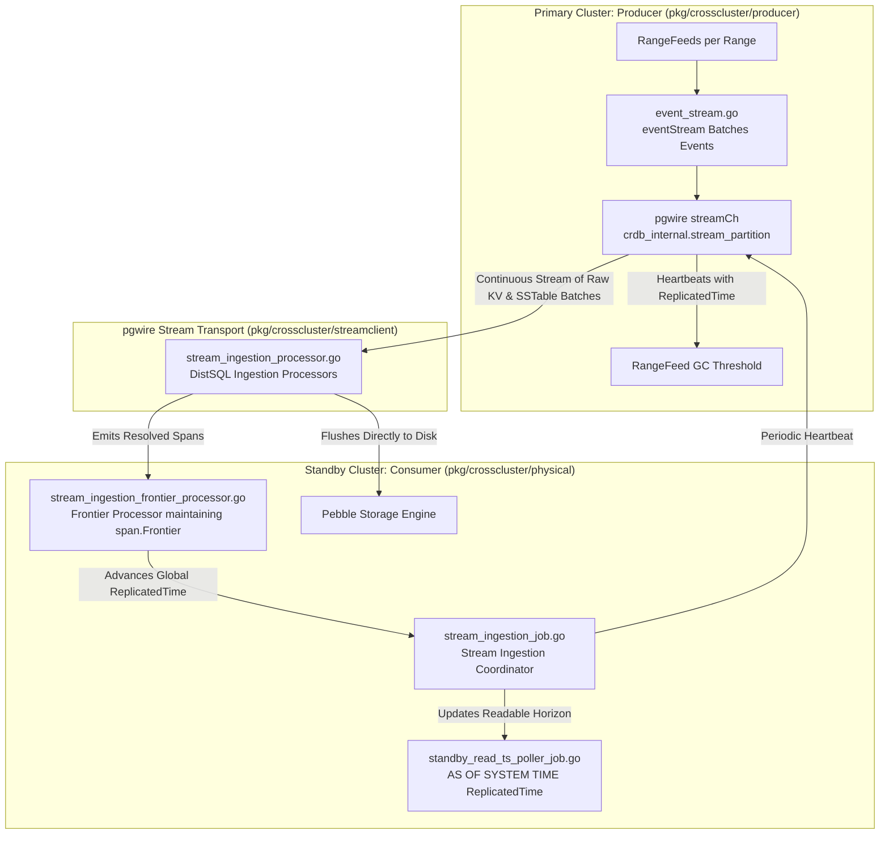
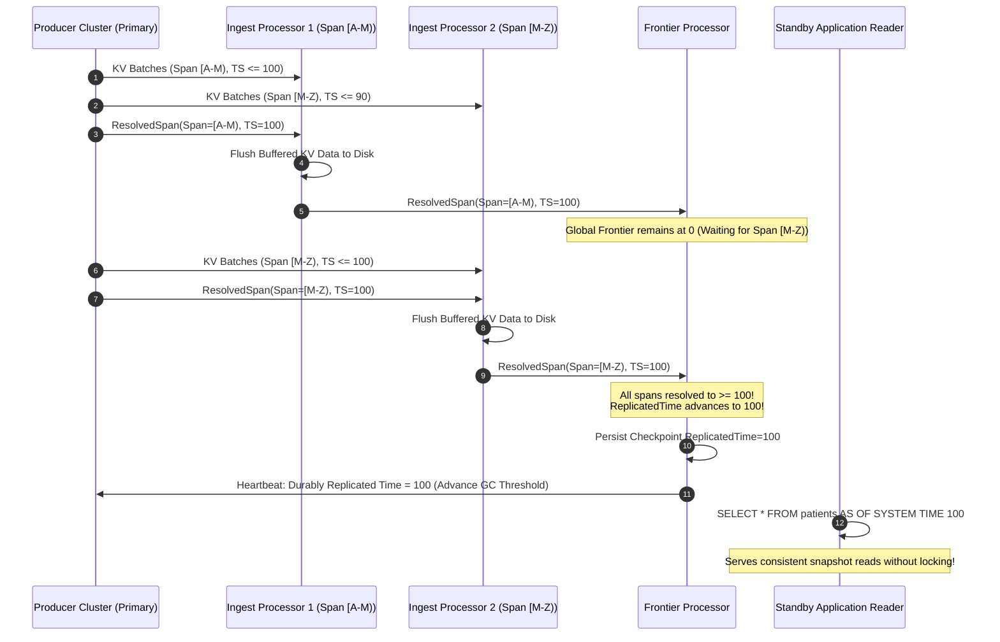
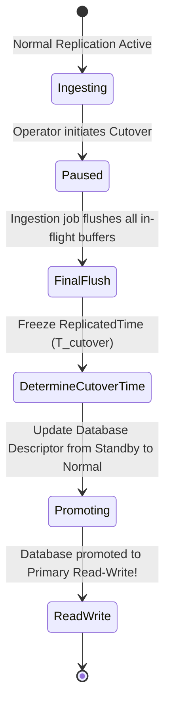

# Physical Cluster Replication (PCR): Low-Level Stream Ingestion & Standby Cutover

## 1. Executive Summary & Purpose

**Physical Cluster Replication (PCR)** is CockroachDB's enterprise-grade subsystem for asynchronous, cross-cluster disaster recovery and continuous data synchronization. Implemented primarily in [`pkg/crosscluster/physical`](file:///Users/bkoo/Documents/Development/GovTech/THKMesh/cockroach/pkg/crosscluster/physical) and [`pkg/crosscluster/producer`](file:///Users/bkoo/Documents/Development/GovTech/THKMesh/cockroach/pkg/crosscluster/producer), PCR operates below the SQL execution layer by streaming raw Key-Value mutations and Pebble SSTable blocks directly from primary cluster ranges to a standby cluster.

### Primary Operational Invariants
- **Near-Zero Recovery Point Objective (RPO)**: Sub-second replication lag under typical network conditions.
- **Instant Recovery Time Objective (RTO)**: Cutover promotes the standby cluster to a read-write primary in seconds without data scans.
- **Zero Primary Impact**: Replication is decoupled from the primary cluster's commit path; primary transactions never wait for standby acknowledgments.
- **Transactionally Consistent Standby Reads**: Standby users can execute read-only queries at consistent historical horizons (`AS OF SYSTEM TIME ReplicatedTime`).

---

## 2. End-to-End System Architecture



---

## 3. Producer-Side Mechanics (`pkg/crosscluster/producer`)

The producer side is responsible for tapping into CockroachDB's internal RangeFeeds and streaming change events to authenticated consumers.

### Key Components:
1. **Replication Manager**: [`pkg/crosscluster/producer/replication_manager.go`](file:///Users/bkoo/Documents/Development/GovTech/THKMesh/cockroach/pkg/crosscluster/producer/replication_manager.go)
   - Exposes producer APIs via internal hooks ([`repstream.GetReplicationStreamManagerHook`](file:///Users/bkoo/Documents/Development/GovTech/THKMesh/cockroach/pkg/repstream/api.go#L19)).
   - Manages tenant authorization and allocates streaming sessions.
2. **Event Stream Multiplexer**: [`pkg/crosscluster/producer/event_stream.go`](file:///Users/bkoo/Documents/Development/GovTech/THKMesh/cockroach/pkg/crosscluster/producer/event_stream.go)
   - Registers RangeFeed callbacks:
     - `onValue(key, val, ts)`: Captures single KV put/delete mutations.
     - `onValues(kvs)`: Batches multiple mutations.
     - `onSSTable(sstBytes)`: Transfers raw bulk-ingested SSTables directly.
     - `onDeleteRange(span)`: Replicates physical range deletions.
3. **Garbage Collection (GC) Protection**:
   - As mutations occur, Pebble's MVCC garbage collection would normally purge older versions.
   - The consumer periodically heartbeats its durably acknowledged `ReplicatedTime`.
   - The producer advances a protected `Rangefeed GC Threshold`, preventing historical data needed by the consumer from being deleted before replication finishes.

---

## 4. Consumer-Side Mechanics (`pkg/crosscluster/physical`)

The consumer runs as a resilient, distributed DistSQL job across nodes of the destination cluster.

### 4.1 Ingestion Flow & Processors
1. **Job Resumer**: [`pkg/crosscluster/physical/stream_ingestion_job.go`](file:///Users/bkoo/Documents/Development/GovTech/THKMesh/cockroach/pkg/crosscluster/physical/stream_ingestion_job.go)
   - Reads `ReplicatedTime` from job progress.
   - Connects to producer via [`streamclient.Client`](file:///Users/bkoo/Documents/Development/GovTech/THKMesh/cockroach/pkg/crosscluster/streamclient/) using `crdb_internal.stream_partition(streamID, spec)`.
   - Passes `InitialScanTimestamp` on first run or the resume frontier timestamp after a crash.
2. **Stream Ingestion Processor**: [`pkg/crosscluster/physical/stream_ingestion_processor.go`](file:///Users/bkoo/Documents/Development/GovTech/THKMesh/cockroach/pkg/crosscluster/physical/stream_ingestion_processor.go)
   - Each processor receives a partitioned subset of range spans.
   - Buffers incoming KV mutations in memory until a threshold or a `ResolvedSpan` is encountered.
   - Direct Ingestion: Flushes buffered data directly into Pebble SSTables, bypassing the entire SQL execution engine.
3. **Frontier Processor**: [`pkg/crosscluster/physical/stream_ingestion_frontier_processor.go`](file:///Users/bkoo/Documents/Development/GovTech/THKMesh/cockroach/pkg/crosscluster/physical/stream_ingestion_frontier_processor.go)
   - Maintains an in-memory `span.Frontier` tracking the minimum resolved timestamp across **ALL** participating spans.
   - Advances `ReplicatedTime` only when all spans have resolved past that horizon.

---

## 5. Checkpoint & Frontier Progression Lifecycle



---

## 6. Timing & Latency Metrics Instrumented in Code

The PCR codebase instruments granular latency metrics to diagnose bottlenecks across distributed WAN links:

```
Producer Side:
  - ProduceWait     : Time waiting to produce (RangeFeed callback → internal batch)
  - EmitWait        : Time waiting to emit batch (batch → pgwire network socket)

Consumer Side:
  - AdmitLatency    : Duration from event MVCC timestamp to event arrival at consumer
  - ReceiveWaitNanos: Time consumer thread was blocked waiting for producer data
  - FlushWaitNanos  : Time blocked waiting for background storage engine flush
  - FlushHistNanos  : Actual elapsed time writing SSTables to storage engine
  - CommitLatency   : Duration from oldest MVCC timestamp in batch to flush completion
```

---

## 7. Cutover & Disaster Recovery Protocol

When an operator or automated orchestrator detects a primary data center failure, cutover executes with mathematical consistency:



1. **Flush In-Flight Buffers**: The ingestion job processes all already-received packets and flushes SSTables.
2. **Freeze Cutover Horizon**: The final `ReplicatedTime` is recorded in system tables.
3. **Descriptor Promotion**: The SQL catalog updates the database descriptor, lifting the read-only restriction.
4. **Immediate Client Availability**: Applications switch connection strings to the promoted cluster. Any write committed before `T_cutover` is guaranteed to be present.

---

## 8. Application & Blueprint for GovTech THKMesh

1. **Hospital Core Database Mirroring**: Regional general hospital clusters running THKMesh can continuously mirror their operational databases to a central government health data center using PCR.
2. **Direct SST Ingestion for High-Bandwidth Telemetry**: Edge sensors (continuous ECG, real-time blood pressure monitors) generate millions of data points during clinical sessions. PCR's direct Pebble SSTable ingestion bypasses SQL parsing, allowing edge-to-hub ingestion at wire speed.
3. **Predictable Disaster Recovery Audits**: Regulatory health compliance requires proof of disaster recovery capability. PCR's continuous `ReplicatedTime` metrics allow automated verification that data loss will never exceed $1$ second.
