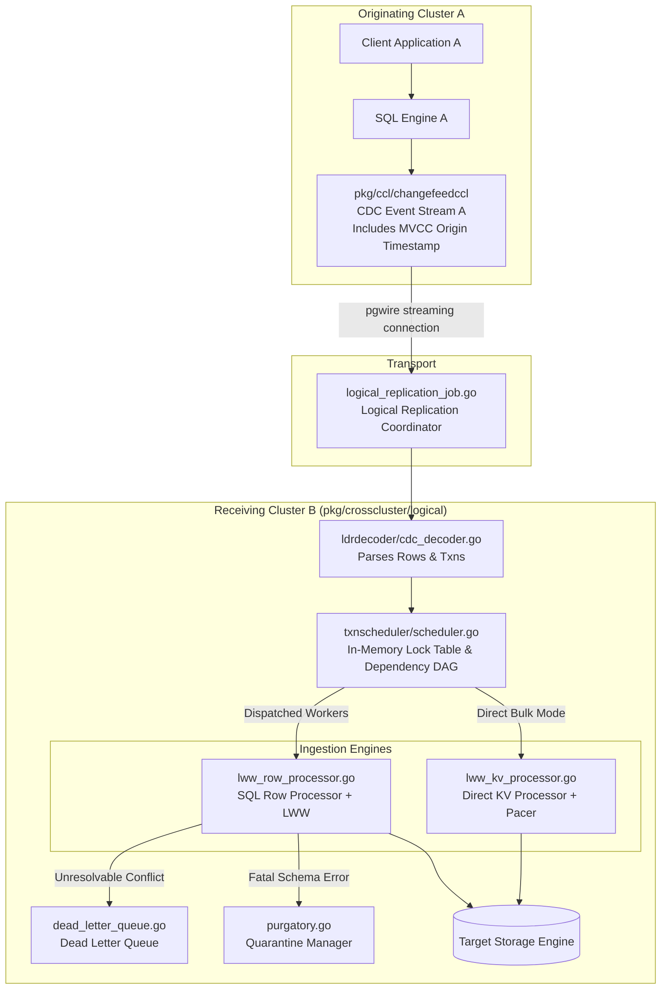
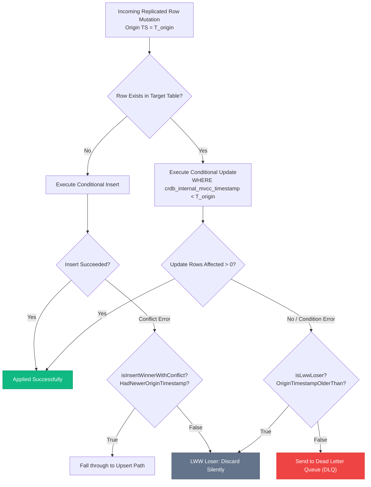
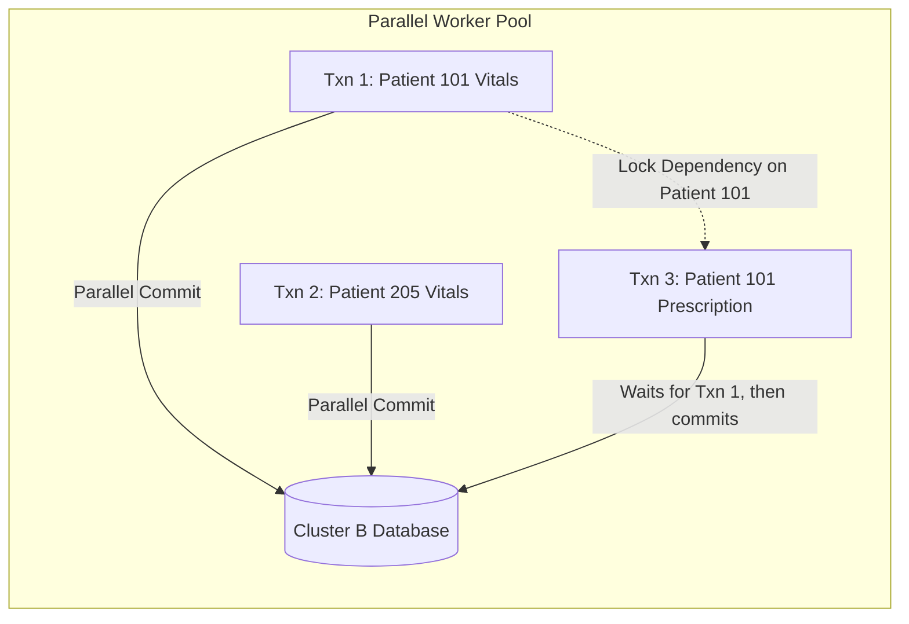

# Logical Data Replication (LDR): Active-Active Multi-Master & Conflict Resolution

## 1. Executive Summary & Core Challenges

**Logical Data Replication (LDR)**, implemented under [`pkg/crosscluster/logical`](file:///Users/bkoo/Documents/Development/GovTech/THKMesh/cockroach/pkg/crosscluster/logical), is CockroachDB's subsystem for **Active-Active, bi-directional multi-master replication** across autonomous database clusters.

Unlike Physical Cluster Replication (PCR), which mirrors raw byte blocks unidirectionally from primary to standby, LDR replicates logical SQL row mutations and transaction envelopes. This fundamental difference unlocks active write capability across all participating locations simultaneously, but introduces two notorious distributed systems challenges:
1. **Concurrent Write Conflicts**: Two users in different regions update the same row at the same time.
2. **Causal Dependency Inversion**: Transaction $T_2$ depends on $T_1$, but network jitter causes $T_2$ to arrive at the remote cluster before $T_1$.

CockroachDB solves these through **MVCC-backed Last-Write-Wins (LWW)** and a dedicated in-memory **Transaction Dependency Scheduler**.

---

## 2. LDR System Architecture



---

## 3. The Last-Write-Wins (LWW) Conflict Resolution Engine

CockroachDB's LWW conflict resolution is implemented directly in [`pkg/crosscluster/logical/lww_row_processor.go`](file:///Users/bkoo/Documents/Development/GovTech/THKMesh/cockroach/pkg/crosscluster/logical/lww_row_processor.go).

### 3.1 Conditional Updates via MVCC Origin Timestamps
Every row mutation emitted by the source cluster carries its originating Hybrid Logical Clock timestamp (`row.MvccTimestamp`). 

When applying an update or delete, the `sqlRowProcessor` constructs a conditional SQL statement referencing CockroachDB's internal metadata column:
```sql
UPDATE target_table 
SET col1 = $1, col2 = $2, crdb_internal_mvcc_timestamp = $origin_ts
WHERE primary_key = $pk 
  AND crdb_internal_mvcc_timestamp < $origin_ts;
```

### 3.2 Conflict Evaluation Logic
CockroachDB categorizes write conflicts via dedicated helper functions:



- **`isLwwLoser(err)`**: Defined in [`lww_row_processor.go#L88`](file:///Users/bkoo/Documents/Development/GovTech/THKMesh/cockroach/pkg/crosscluster/logical/lww_row_processor.go#L88). Returns true if the storage engine returned a `ConditionFailedError` with `OriginTimestampOlderThan` set, confirming the local row is strictly newer than the incoming update.
- **`isInsertWinnerWithConflict(err)`**: Defined in [`lww_row_processor.go#L99`](file:///Users/bkoo/Documents/Development/GovTech/THKMesh/cockroach/pkg/crosscluster/logical/lww_row_processor.go#L99). Handles the race condition where an insert won the timestamp comparison against a concurrent local row, but failed due to unique key collision; the row processor automatically falls through to an update/upsert.

---

## 4. Transaction Dependency Scheduler (`txnscheduler`)

To apply incoming replicated transactions concurrently across multiple worker threads without violating causal consistency, CockroachDB implements an in-memory lock scheduler in [`pkg/crosscluster/logical/txnscheduler/scheduler.go`](file:///Users/bkoo/Documents/Development/GovTech/THKMesh/cockroach/pkg/crosscluster/logical/txnscheduler/scheduler.go).

### 4.1 Lock Dependency Rules
The scheduler infers locks based on the keys modified or read by each transaction:
- **Write Lock**: Acquired for each mutated key.
- **Read Lock**: Acquired for foreign-key validation or conditional lookups (tracks up to 8 concurrent read locks per key hash).

| Existing Lock | Incoming Read Lock | Incoming Write Lock | Action |
| :--- | :--- | :--- | :--- |
| **Read Lock** | Concurrent (No dependency) | **Dependency Created** | Incoming write must wait for read to commit. |
| **Write Lock** | **Dependency Created** | **Dependency Created** | Incoming transaction must wait for prior write to commit. |

### 4.2 Dependency DAG Output
The scheduler transforms raw transaction streams into:
$$\text{ScheduledTxn} = \langle \text{TxnID}, \text{DependentTxns}[], \text{MinimumAppliedTime} \rangle$$
Because dependencies are transitive, if transaction $A \to B \to C$, the applier only needs to track direct ancestors, enabling parallel execution across thousands of independent key ranges.



---

## 5. Dual Ingestion Processors: SQL vs. Direct KV

LDR provides two distinct execution engines to balance relational safety against raw ingestion throughput:

| Dimension | `sqlRowProcessor` ([`lww_row_processor.go`](file:///Users/bkoo/Documents/Development/GovTech/THKMesh/cockroach/pkg/crosscluster/logical/lww_row_processor.go)) | `kvRowProcessor` ([`lww_kv_processor.go`](file:///Users/bkoo/Documents/Development/GovTech/THKMesh/cockroach/pkg/crosscluster/logical/lww_kv_processor.go)) |
| :--- | :--- | :--- |
| **Execution Path** | Generates and executes parameterized SQL statements via internal executor. | Bypasses SQL engine completely; writes raw Key-Value pairs directly into the storage engine. |
| **Constraint Validation** | Enforces foreign keys, check constraints, and triggers. | Bypasses constraint checks (assumes source cluster validated them). |
| **Throughput** | Moderate ($10,000 - 30,000$ rows/sec per node). | **Extremely High** ($100,000+ \text{ rows/sec}$ with CPU pacer). |
| **Schema Tolerance** | Handles heterogeneous column orders, column renames, and types. | Requires identical physical column encoding. |
| **Primary Use Case** | Bi-directional multi-master application replication. | High-throughput offline initial scan & bulk synchronization. |

---

## 6. Dead Letter Queue (DLQ) & Quarantine Management

When a replicated row mutation fails due to unrecoverable errors (e.g., target table schema drift, unresolvable foreign key violation, or user-defined trigger failure), CockroachDB cannot silently drop the event, nor can it halt the entire replication stream.

Implemented in [`pkg/crosscluster/logical/dead_letter_queue.go`](file:///Users/bkoo/Documents/Development/GovTech/THKMesh/cockroach/pkg/crosscluster/logical/dead_letter_queue.go):
1. **Mutation Isolation**: The failed row, its source schema descriptor, the raw datum values, and the exact error code are captured.
2. **Asynchronous DLQ Ingestion**: Written to a dedicated system table (`system.replication_dlq`) in an autonomous transaction.
3. **Stream Continuity**: The main replication stream advances its resolved frontier, preventing an isolated malformed record from stalling replication for healthy tables.
4. **Administrative Triage**: Operators query the DLQ via SQL, inspect conflicting records, apply remediation scripts, and replay quarantined rows.

---

## 7. Application & Blueprint for GovTech THKMesh

1. **Active-Active Healthcare Polyclinics**: In distributed healthcare deployments, clinics in different geographical zones must operate autonomously even when wide-area connections are degraded. LDR enables each clinic to run an active read-write database.
2. **Deterministic Conflict Handling**: If a patient updates their contact details on an edge kiosk while a hospital administrator updates insurance status at the main hospital, LDR's Last-Write-Wins logic resolves the record deterministically using HLC timestamps.
3. **Medical Regulatory DLQ Compliance**: In healthcare, silent data dropping is a severe clinical liability. THKMesh will adopt CockroachDB's DLQ architecture to ensure all conflicting or rejected clinical records are permanently logged for physician review.
