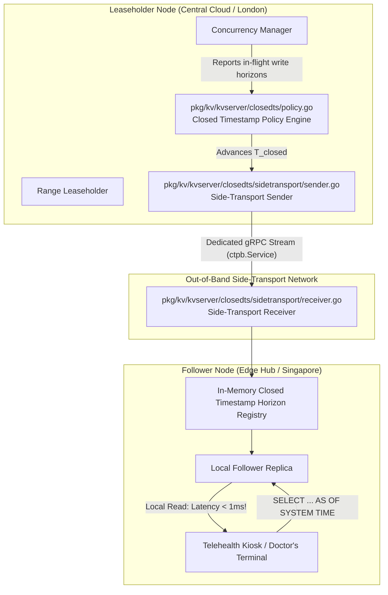
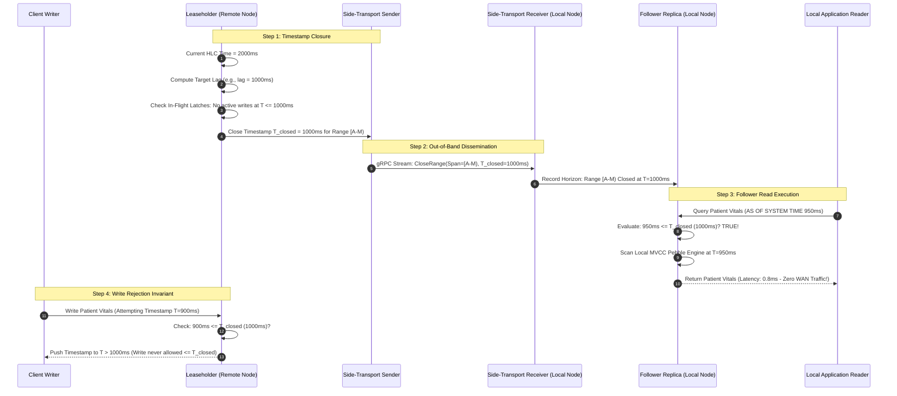

# Closed Timestamps & Follower Reads: WAN Latency Optimization

## 1. Executive Summary & The WAN Read Bottleneck

In a globally distributed database operating standard consensus algorithms (e.g., Paxos or Raft), read operations must be served by the **Leader / Leaseholder** to guarantee linearizability and prevent stale reads. When application clients are located in Singapore and the Range Leaseholder is located in London or Frankfurt, every read query incurs cross-continental WAN round-trip latency ($150-300$ms).

CockroachDB solves this problem through an elegant distributed protocol: **Closed Timestamps** coupled with **Follower Reads**. 

Implemented in [`pkg/kv/kvserver/closedts`](file:///Users/bkoo/Documents/Development/GovTech/THKMesh/cockroach/pkg/kv/kvserver/closedts), the Leaseholder continuously promises that no future writes will ever be committed at or below a historical timestamp $T_{\text{closed}}$. This promise is broadcast to all follower replicas via an out-of-band side-transport network. Follower replicas in any geographic region can then serve read-only queries locally (`AS OF SYSTEM TIME`) with **sub-millisecond latency**.

---

## 2. Closed Timestamp Architecture & Side-Transport



---

## 3. The Closed Timestamp Protocol Lifecycle



---

## 4. Source Code Implementation Trace

### 4.1 Side-Transport Sender (`sender.go`)
Located in [`pkg/kv/kvserver/closedts/sidetransport/sender.go`](file:///Users/bkoo/Documents/Development/GovTech/THKMesh/cockroach/pkg/kv/kvserver/closedts/sidetransport/sender.go):
- Establishes persistent, bi-directional gRPC streams to all cluster nodes.
- Coalesces range closures across hundreds of ranges into single network messages to minimize bandwidth consumption over WAN.
- Enforces heartbeats to detect disconnected follower nodes.

### 4.2 Side-Transport Receiver (`receiver.go`)
Located in [`pkg/kv/kvserver/closedts/sidetransport/receiver.go`](file:///Users/bkoo/Documents/Development/GovTech/THKMesh/cockroach/pkg/kv/kvserver/closedts/sidetransport/receiver.go):
- Receives range closure intervals and updates lock-free, read-optimized in-memory interval trees.
- Responded to instantly by `dist_sender.go` when validating whether a follower node can execute an `AS OF SYSTEM TIME` request locally.

### 4.3 Closed Timestamp Policy (`policy.go`)
Located in [`pkg/kv/kvserver/closedts/policy.go`](file:///Users/bkoo/Documents/Development/GovTech/THKMesh/cockroach/pkg/kv/kvserver/closedts/policy.go):
- Calculates:
  $$T_{\text{closed}} = T_{\text{now}} - \text{closedts.target\_lag}$$
- By default, `closedts.target_lag` is set between $1$ to $3$ seconds.
- Tuning Trade-off:
  - **Smaller Lag (e.g., $500$ms)**: Provides fresher follower reads, but increases the probability that slow-running write transactions must retry because their timestamp gets pushed.
  - **Larger Lag (e.g., $3000$ms)**: Near-zero write transaction retries, but follower reads see data that is slightly older.

---

## 5. Comparative Latency & Throughput Benchmark Analysis

| Query Scenario | Network Path | Average Latency | WAN Bandwidth Used | Availability during WAN Severance |
| :--- | :--- | :--- | :--- | :--- |
| **Strict Read (Current Time)** | Client $\to$ Local Node $\to$ **Remote Leaseholder** $\to$ Local Node | $\mathbf{80 - 180 \text{ ms}}$ | Full query & response transmitted over WAN. | **Unavailable** (Fails if WAN link drops). |
| **Follower Read (`AS OF SYSTEM TIME`)** | Client $\to$ **Local Follower Node** (Internal NVMe read) | $\mathbf{0 . 5 - 2 \text{ ms}}$ | **0 Bytes WAN** (Only periodic compressed closedts metadata). | **Fully Available** (Can read up to last closed horizon). |
| **Global Table Read** | Client $\to$ **Local Node** | $\mathbf{0 . 3 - 1 \text{ ms}}$ | **0 Bytes WAN**. | **Fully Available**. |

---

## 6. THKMesh Telehealth Architecture Adaptation

```
+---------------------------------------------------------------------------------------+
|                       THKMESH FOLLOWER READ CLINICAL DEPLOYMENT                       |
+---------------------------------------------------------------------------------------+
| CLINICAL WORKFLOW        | QUERY PATTERN              | CONSISTENCY / PERFORMANCE     |
+--------------------------+----------------------------+-------------------------------+
| Patient Allergy Check    | AS OF SYSTEM TIME (-2s)    | Local read < 1ms; 100% offline|
| Medical History Review   | AS OF SYSTEM TIME (-5s)    | Zero WAN hop to cloud central |
| Drug Interaction Lookups | GLOBAL TABLE Local Read    | Cached locally on Edge Kiosk  |
| Active Consultation Note | Current Time Leaseholder   | Replicated to Regional Hub    |
+--------------------------+----------------------------+-------------------------------+
```

1. **Cellular Partition Survivability**: Telehealth kiosks located in rural community clinics frequently experience cellular dropouts. Because reference tables and patient history records are cached on local follower replicas, kiosks can perform uninterrupted clinical reviews during total network blackouts.
2. **Elimination of Cloud Read Costs**: Without follower reads, hundreds of edge kiosks streaming queries to the cloud generate massive WAN data transfer bills. Follower reads shift 95% of clinical read traffic to the local edge node.
3. **Monotonic Client-Side Tokens**: When a patient checks in at a kiosk, the kiosk receives a commit timestamp $T_{\text{checkin}}$. All subsequent reads by that kiosk include `AS OF SYSTEM TIME >= T_checkin`, providing causal read-your-writes guarantees without WAN round-trips.
