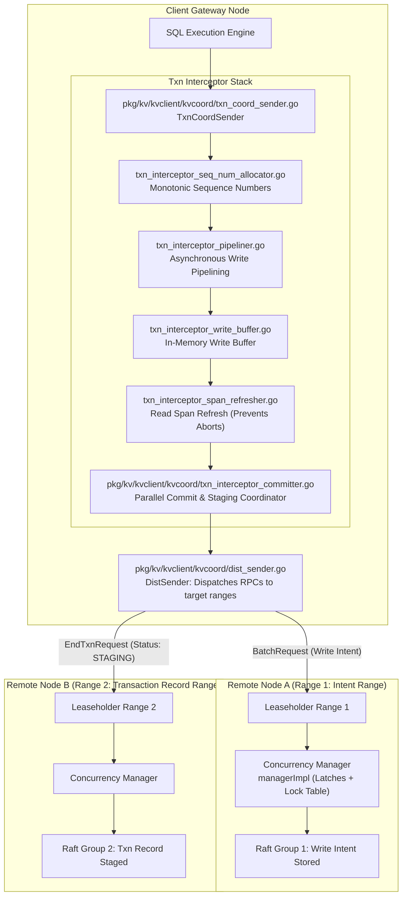
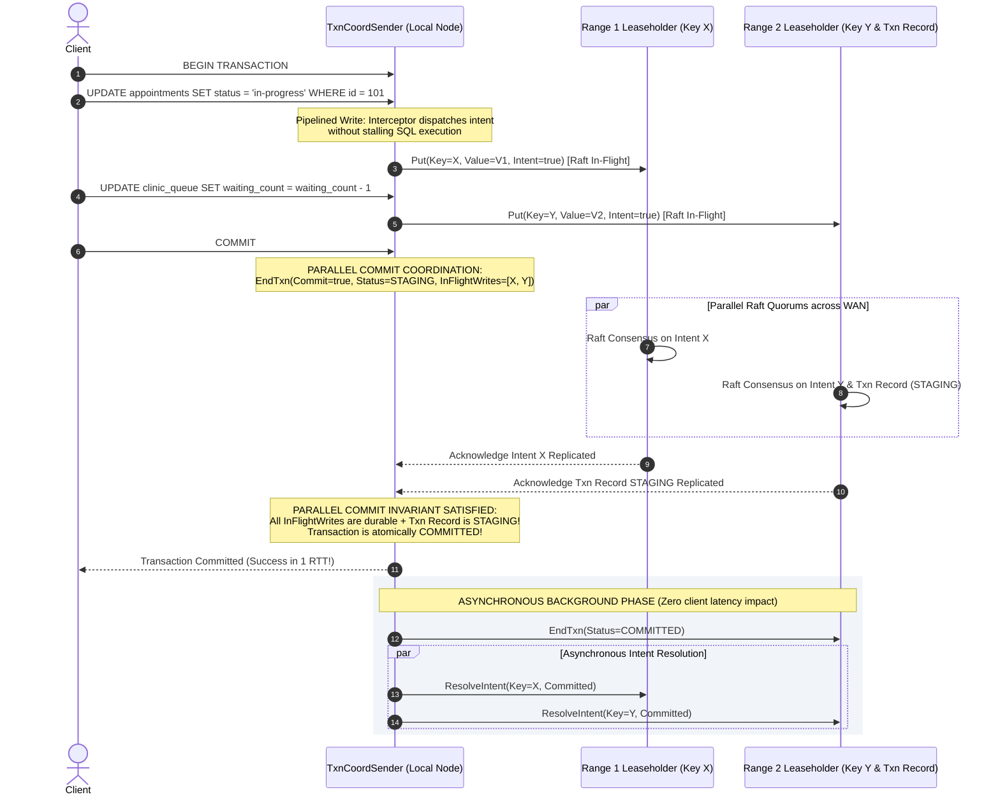
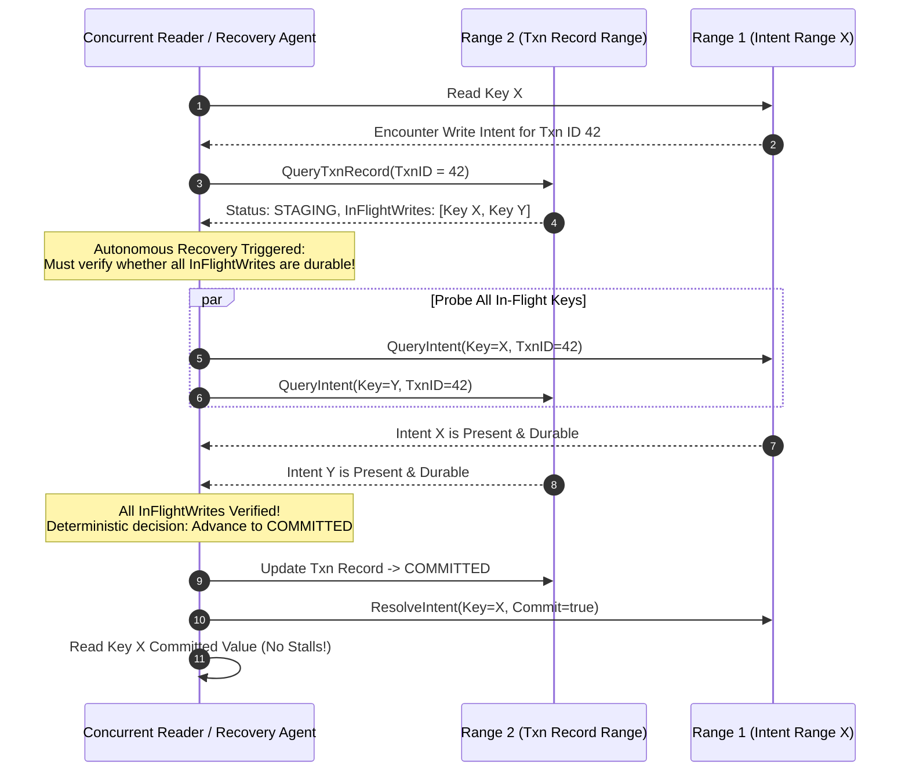

# CockroachDB Distributed Transactions & Parallel Commits: 1-RTT Multi-Region 2PC

## 1. Executive Summary & Problem Scope

In distributed SQL databases, transactions frequently span multiple **Ranges** located on disparate physical nodes across availability zones and geographic regions. Standard Two-Phase Commit (2PC) protocols require multiple sequential network round-trips:
1. Replicating write intents across all participant nodes ($\ge 1$ Raft RTT).
2. Updating the persistent transaction record from `PENDING` to `COMMITTED` ($1$ Raft RTT).
3. Resolving write intents into permanent MVCC keys.

Across a high-latency Wide Area Network (WAN), where a single cross-region Raft round-trip takes $60$ to $100$ms, traditional 2PC imposes unacceptable write latency ($150$ to $300$ms) and holds transactional locks across WAN delays, drastically degrading concurrency.

CockroachDB eliminates this bottleneck through **Parallel Commits**:
- Merges the write pipelining and commit phases into a **single concurrent Raft round-trip (1-RTT Commit)**.
- Replaces the blocking transaction state update with an atomic **`STAGING`** state machine protocol.
- Moves intent resolution entirely out of the client-facing latency path into asynchronous background workers.



---

## 2. The Transaction Interceptor Pipeline Stack

All key-value operations initiated by the SQL layer flow through an ordered chain of interceptors managed by [`TxnCoordSender`](file:///Users/bkoo/Documents/Development/GovTech/THKMesh/cockroach/pkg/kv/kvclient/kvcoord/txn_coord_sender.go):

| Interceptor | Source File Anchor | Architectural Responsibility |
| :--- | :--- | :--- |
| **`txnHeartbeater`** | [`txn_interceptor_heartbeater.go`](file:///Users/bkoo/Documents/Development/GovTech/THKMesh/cockroach/pkg/kv/kvclient/kvcoord/txn_interceptor_heartbeater.go) | Periodically writes heartbeats to the transaction record in the system keyspace to prevent abandoned transactions from holding locks indefinitely. |
| **`txnSeqNumAllocator`** | [`txn_interceptor_seq_num_allocator.go`](file:///Users/bkoo/Documents/Development/GovTech/THKMesh/cockroach/pkg/kv/kvclient/kvcoord/txn_interceptor_seq_num_allocator.go) | Assigns monotonically increasing sequence numbers to each statement within a transaction, ensuring idempotent replay on network retry. |
| **`txnPipeliner`** | [`txn_interceptor_pipeliner.go:L228`](file:///Users/bkoo/Documents/Development/GovTech/THKMesh/cockroach/pkg/kv/kvclient/kvcoord/txn_interceptor_pipeliner.go#L228) | Tracks in-flight write operations. Allows SQL execution to proceed without waiting for Raft replication acknowledgement on every individual statement. |
| **`txnSpanRefresher`** | [`txn_interceptor_span_refresher.go`](file:///Users/bkoo/Documents/Development/GovTech/THKMesh/cockroach/pkg/kv/kvclient/kvcoord/txn_interceptor_span_refresher.go) | If a transaction's timestamp is pushed by a concurrent write, this interceptor refreshes previous read spans to verify no intervening writes occurred, avoiding full transaction aborts. |
| **`txnCommitter`** | [`txn_interceptor_committer.go:L128`](file:///Users/bkoo/Documents/Development/GovTech/THKMesh/cockroach/pkg/kv/kvclient/kvcoord/txn_interceptor_committer.go#L128) | Intercepts `EndTxn` requests. Computes whether Parallel Commit is applicable, attaches the list of `InFlightWrites`, and manages the transition through `STAGING`. |

---

## 3. Parallel Commit Execution Lifecycle (1-RTT Commit)

Traditional distributed 2PC requires two sequential Raft consensus steps: Prepare (intents written) followed by Commit (transaction record updated). 

In CockroachDB's **Parallel Commit protocol**, both steps are dispatched concurrently over the network:



### 3.1 The `STAGING` State Machine Invariant
The fundamental innovation of Parallel Commit is that a transaction record in the `STAGING` state represents a **conditional commit**:
- The record stores an array of key spans: `InFlightWrites = [Key_1, Key_2, ..., Key_N]`.
- **Commit Rule**: If and only if **all** writes listed in `InFlightWrites` have successfully achieved Raft consensus, the transaction is irrevocably **COMMITTED**.
- If any intent in `InFlightWrites` was rejected or aborted, the transaction is **ABORTED**.

Because the client coordinator verifies that all in-flight intent acks and the `STAGING` record ack have returned before sending success to the client, the transaction is guaranteed committed in a single round-trip.

---

## 4. Crash Recovery Protocol for Staged Transactions

What happens if the client coordinator machine suffers a sudden power loss or network partition immediately after receiving acknowledgements, leaving the transaction record in `STAGING`?



This recovery protocol guarantees:
1. **Zero Deadlocks**: Concurrent readers do not hang waiting for a failed coordinator to wake up; they self-resolve the staged transaction.
2. **Deterministic Atomicity**: Every reader probing the staged transaction evaluates the identical set of durable intents and reaches the identical commit/abort conclusion.

---

## 5. The Concurrency Manager: Latches & Lock Table

Implemented in [`pkg/kv/kvserver/concurrency/concurrency_manager.go:L197`](file:///Users/bkoo/Documents/Development/GovTech/THKMesh/cockroach/pkg/kv/kvserver/concurrency/concurrency_manager.go#L197) via `managerImpl`, the Concurrency Manager provides low-level coordination between concurrent transactions arriving at a Range Leaseholder:
- **In-Memory Latches**: Very short-lived synchronization primitives (microseconds duration) that serialize access to the Range's local memory structures and Pebble storage engine during request evaluation.
- **Lock Table**: Durable in-memory locks tracking transaction write intents. If Transaction B attempts to write a key locked by Transaction A:
  - If Transaction A has higher priority, Transaction B waits on the lock table queue.
  - If Transaction B has higher priority, it can preempt or push Transaction A's timestamp via `PushTxn`.

---

## 6. Comparative Latency & Overhead Analysis

| Metric | Standard Distributed 2PC | CockroachDB Parallel Commit | Google Spanner | DynamoDB Transactions |
| :--- | :--- | :--- | :--- | :--- |
| **Commit Network Latency** | $2 \times \text{WAN Raft RTT}$ | $\mathbf{1 \times \text{WAN Raft RTT}}$ | $2 \times \text{WAN Paxos RTT}$ | $2 \times \text{Coordinator RTT}$ |
| **Pipelined Statement Writes** | No (synchronous waits per statement) | **Yes** (`txnPipeliner.go`) | Yes (buffered writes) | No |
| **Client Commit Latency (Cross-Region)** | $\approx 160-240 \text{ ms}$ | $\mathbf{\approx 80-120 \text{ ms}}$ | $\approx 150-200 \text{ ms}$ | $\approx 80-150 \text{ ms}$ |
| **Lock Holding Duration** | High (held across 2 WAN RTTs) | **Low (held across 1 WAN RTT)** | Medium | High |
| **Crash Recovery Mechanism** | Coordinator logging | Decentralized Intent Probing | Paxos Leader Recovery | Centralized Coordinator |
| **Isolation Level** | Serializable | **Strict Serializable (SSI)** | Strict Serializable (SSI) | Serializable |

---

## 7. THKMesh Telehealth Architecture Adaptation

```
+---------------------------------------------------------------------------------------+
|                    THKMESH DISTRIBUTED TRANSACTION WORKFLOW                           |
+---------------------------------------------------------------------------------------+
| CLINICAL SCENARIO         | INVOLVED RANGES            | PARALLEL COMMIT BENEFIT      |
+---------------------------+----------------------------+-------------------------------+
| Patient Queue Transfer    | Kiosk Queue + Clinic Queue | Atomic transfer in 1 RTT;     |
| (Kiosk to Polyclinic)     | across two regional hubs   | zero double-booking hazard    |
| Prescription Dispensation | Patient Chart + Pharmacy   | Atomically deducts inventory  |
|                           | Inventory at Hospital Hub  | while recording prescription  |
| Tele-Consultation Checkin | Video Room + Doctor Schedule| Zero tail latency for doctor  |
|                           | across WAN cloud instances | during high-volume checkins   |
+---------------------------+----------------------------+-------------------------------+
```

### Direct Implementation Directives for THKMesh:
1. **Low-Latency Edge Check-ins**: In rural or high-density community clinics, telehealth kiosks cannot wait 250ms for cross-range distributed locks. Adopting Parallel Commits reduces registration latency by 50%, preventing patient check-in queues from backing up.
2. **Cellular Disconnect Resilience via Autonomous Recovery**: Kiosk cellular links frequently disconnect midway through multi-statement consultation uploads. CockroachDB's decentralized recovery protocol ensures that any regional hospital node can independently resolve abandoned `STAGING` transactions without human operator intervention.
3. **Decoupled Asynchronous Cleanup**: Intent resolution is offloaded from edge kiosks to background workers on regional hospital servers, conserving battery and compute resources on constrained kiosk hardware.
