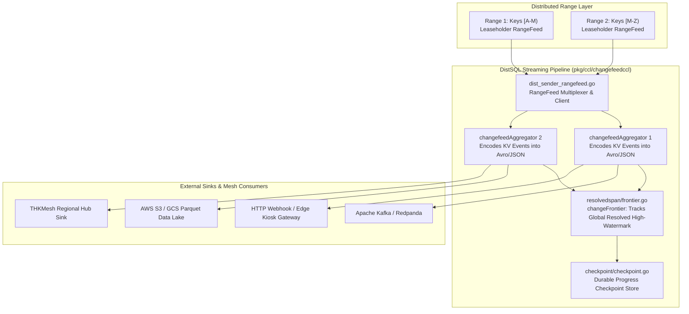
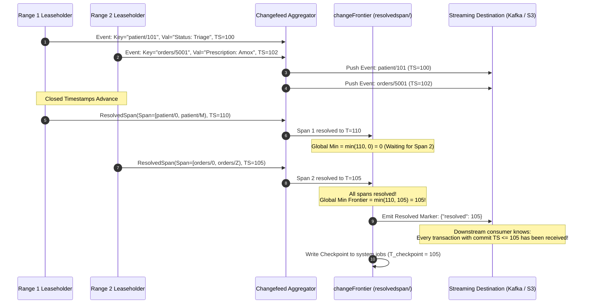

# Change Data Capture (CDC) & RangeFeeds: Distributed Real-Time Streaming

## 1. Executive Summary & Core Challenges

Traditional databases rely on external log scrapers (e.g., Debezium polling PostgreSQL WAL) or application-level dual-writes to synchronize changes with external systems. In a globally distributed database where data is partitioned across thousands of moving Ranges, traditional single-log scraping completely breaks down.

CockroachDB solves distributed change streaming via two tightly coupled layers:
1. **RangeFeed Storage Primitive**: An internal, push-based reactive notification hook registered directly on individual Range Leaseholders ([`pkg/kv/kvclient/kvcoord/dist_sender_rangefeed.go`](file:///Users/bkoo/Documents/Development/GovTech/THKMesh/cockroach/pkg/kv/kvclient/kvcoord/dist_sender_rangefeed.go)).
2. **Change Data Capture (Changefeeds)**: A distributed execution engine ([`pkg/ccl/changefeedccl`](file:///Users/bkoo/Documents/Development/GovTech/THKMesh/cockroach/pkg/ccl/changefeedccl)) that encodes raw KV mutations, coordinates schema transitions, aggregates **Resolved Span Frontiers**, and flushes ordered events to external sinks (Kafka, AWS S3, Google Cloud Pub/Sub, Webhooks).

---

## 2. End-to-End Changefeed Architecture



---

## 3. The RangeFeed Storage Primitive (`dist_sender_rangefeed.go`)

RangeFeeds turn static key ranges into reactive, real-time event streams:

### 3.1 Transparent Range Movement Handling
In a dynamic CockroachDB cluster, ranges frequently split, merge, and transfer leases. The `dist_sender_rangefeed.go` multiplexer insulates consumers from these underlying physical transitions:
- **Range Splits**: When Range $[A, Z)$ splits into $[A, M)$ and $[M, Z)$, the RangeFeed client automatically opens two concurrent child streams starting from the exact split timestamp.
- **Lease Transfers**: When a lease moves to another node, the client catches the `NotLeaseholderError`, looks up the new leaseholder in the Gossip network, and resumes streaming without event duplication.

### 3.2 Event Categories Emitted by RangeFeed
```go
type RangeFeedEvent struct {
    Val          *roachpb.Value  // Updated value
    PrevVal      *roachpb.Value  // Before-image (for CDC before/after queries)
    Key          roachpb.Key     // Primary / index key
    Timestamp    hlc.Timestamp   // MVCC commit timestamp
    ResolvedSpan *roachpb.Span   // Indicates span is closed up to Timestamp
}
```

---

## 4. The Resolved Span Protocol: Guaranteeing Snapshot Consistency

The single greatest challenge in distributed streaming is determining when a multi-table transaction has completely arrived. Because different ranges emit events at varying speeds, events arrive out of global order.

CockroachDB solves this using **Resolved Spans**:



---

## 5. Durable Checkpointing & Resumption

Unlike Kafka message offsets (which are single linear integers), a CockroachDB changefeed checkpoint represents a multi-dimensional cut across thousands of physical ranges:

1. **Periodic Checkpoint Flushing**: Handled in [`pkg/ccl/changefeedccl/checkpoint`](file:///Users/bkoo/Documents/Development/GovTech/THKMesh/cockroach/pkg/ccl/changefeedccl/checkpoint). The `changeFrontier` periodically serializes the high-watermark timestamp into the `system.jobs` table.
2. **Crash Resumption**: If the node running a changefeed aggregator crashes:
   - The cluster job coordinator detects the failure and re-spawns the changefeed on a healthy node.
   - The new job reads the last persisted checkpoint timestamp $T_{\text{checkpoint}}$.
   - RangeFeeds are reopened with `ResumeTimestamp = T_checkpoint`.
   - The stream resumes with zero data loss.

---

## 6. Sinks & Serialization Formats

CockroachDB supports enterprise streaming sinks with native schema awareness:

| Sink Type | Transport Protocol | Serialization Formats Supported | Key Operational Features |
| :--- | :--- | :--- | :--- |
| **Kafka / Redpanda** | Kafka Producer Protocol (SASL/TLS) | JSON, Avro (Confluent Schema Registry), Protobuf | Partition key hashing, batch compression (Snappy, Zstd, Gzip). |
| **Cloud Object Storage** | S3 / GCS / Azure Blob HTTP API | CSV, Parquet, JSON lines | Micro-batching files by size or duration ($10$s / $100$MB). |
| **Google Cloud Pub/Sub** | gRPC Streaming API | JSON, Protobuf | Dynamic topic routing based on table name. |
| **Webhooks** | HTTP/2 POST with HMAC authentication | JSON | Direct delivery to edge API gateways and serverless handlers. |

---

## 7. Application & Blueprint for GovTech THKMesh

```
+---------------------------------------------------------------------------------------+
|                       THKMESH EVENT STREAMING BLUEPRINT                               |
+---------------------------------------------------------------------------------------+
| SOURCE WORKFLOW          | SINK DESTINATION         | STREAM FORMAT & BENEFIT         |
+--------------------------+--------------------------+---------------------------------+
| Kiosk Patient Vital Signs| Regional Hospital Kafka  | Avro + Schema Registry (Strict) |
| Clinic Drug Dispensing   | National Drug Inventory  | Real-time Webhook Push to Hub   |
| Diagnostic Consultations | S3 Medical Archive (WORM)| Parquet Micro-batches (Audit)   |
| System Security Logs     | GovTech SIEM Central     | JSON Streaming via RangeFeed    |
+--------------------------+--------------------------+---------------------------------+
```

1. **Elimination of Dual-Write Bugs**: Edge kiosk application code should never write to both a local database and a message broker. Doing so leads to phantom events or silent data drops when networks fail. By adopting CockroachDB's changefeed pattern, clinical applications write only to the local database, and the database automatically streams guaranteed change events.
2. **Resilient Micro-Batching to Cloud**: For telehealth kiosks with metered cellular bandwidth, changefeeds can buffer mutations and upload compressed Parquet batches when Wi-Fi is available.
3. **Downstream Cache Invalidation**: Hospital clinician web dashboards subscribe to changefeed resolved spans, updating UI patient queues in real time without continuous polling.
