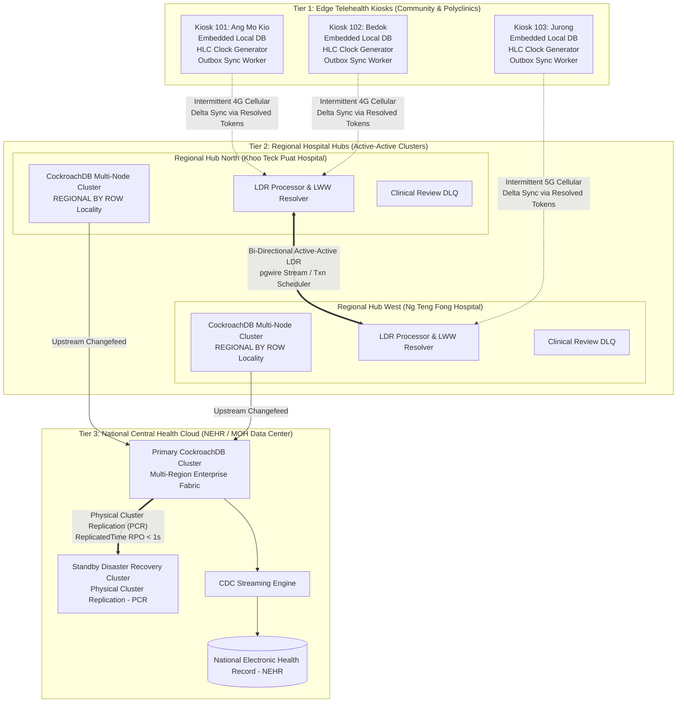
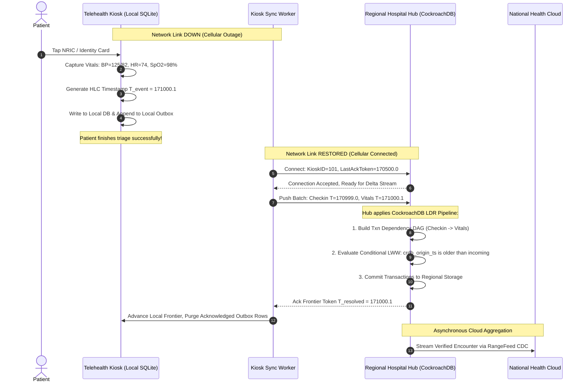
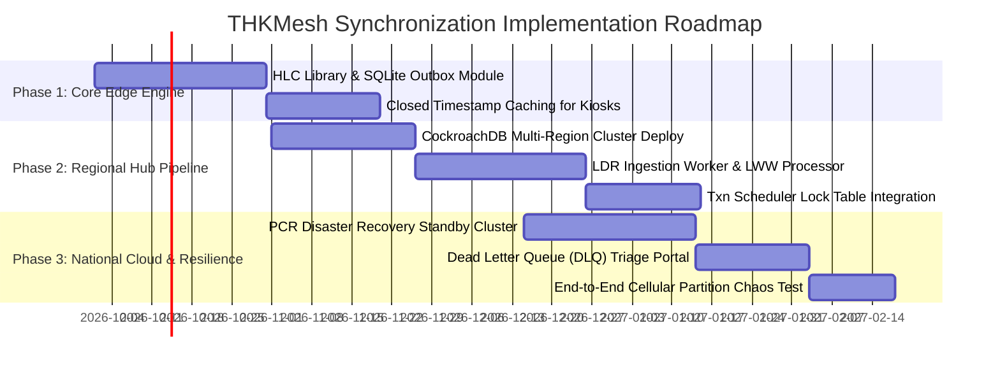

# THKMesh Architecture Blueprint: Multi-Location & Multi-Database Synchronization

## 1. Executive Summary & Problem Formulation

The **GovTech Telehealth Kiosk Mesh (THKMesh)** is a mission-critical public health infrastructure connecting hundreds of unattended community telehealth kiosks, regional polyclinics, acute-care hospitals, and national health cloud systems.

### Operational Challenges of THKMesh
1. **Flaky Network Connectivity**: Kiosks operate over public 4G/5G cellular connections subject to frequent signal degradation, packet loss, and extended offline blackouts.
2. **Local Operational Autonomy**: A citizen presenting for medical triage, biometric scanning, or tele-consultation must never be turned away due to cloud network outages. Kiosks must register patients, measure vitals, and issue prescriptions in 100% offline mode.
3. **Medical Data Integrity & Zero Data Loss**: Clinical information cannot tolerate silent overwrites, split-brain race conditions, or dropped sensor records.
4. **Data Sovereignty & Strict Privacy**: Patient identifiers and consultation recordings must reside within authorized regional security perimeters, synchronizing only compliant records upstream.

By extracting and synthesizing the reverse-engineered architectural patterns from CockroachDB (Multi-Raft, HLC, Closed Timestamps, PCR, and LDR), this blueprint provides the comprehensive engineering design for THKMesh.

---

## 2. End-to-End Three-Tier Topology Architecture



---

## 3. Adaptation of CockroachDB Core Principles to THKMesh

| CockroachDB Pattern | Subsystem Origin | THKMesh Edge/Hub Realization | Value Delivered |
| :--- | :--- | :--- | :--- |
| **Hybrid Logical Clocks (HLC)** | [`pkg/util/hlc/hlc.go`](file:///Users/bkoo/Documents/Development/GovTech/THKMesh/cockroach/pkg/util/hlc/hlc.go) | Kiosk clients stamp all sensor reads and triage events with a local HLC token $\langle \text{wall}, \text{logical} \rangle$. | Guarantees absolute causal ordering across distributed clinics even if kiosk clocks drift by minutes. |
| **Closed Timestamps & Follower Reads** | [`pkg/kv/kvserver/closedts`](file:///Users/bkoo/Documents/Development/GovTech/THKMesh/cockroach/pkg/kv/kvserver/closedts) | Edge kiosks maintain local follower replicas of reference catalogs (drugs, staff, diagnostic codes). | **100% offline read availability**; drug allergy lookups execute in $<1$ms without WAN reliance. |
| **Logical Replication & LWW** | [`pkg/crosscluster/logical`](file:///Users/bkoo/Documents/Development/GovTech/THKMesh/cockroach/pkg/crosscluster/logical) | Hubs synchronize patient records using conditional SQL updates against MVCC origin timestamps. | Automatic, mathematically deterministic resolution of concurrent doctor/patient profile edits. |
| **Transaction Dependency Scheduler** | [`txnscheduler/scheduler.go`](file:///Users/bkoo/Documents/Development/GovTech/THKMesh/cockroach/pkg/crosscluster/logical/txnscheduler/scheduler.go) | Regional hubs maintain an in-memory lock table when applying batches from reconnecting kiosks. | Ingests offline batches concurrently across worker threads while preserving causal transaction chains. |
| **Resolved Span Frontiers** | [`changefeedccl/resolvedspan`](file:///Users/bkoo/Documents/Development/GovTech/THKMesh/cockroach/pkg/ccl/changefeedccl/resolvedspan/) | Kiosks track a persistent sync token ($T_{\text{resolved}}$) representing the last acknowledged event. | Zero duplicate event transmissions; minimal cellular bandwidth consumption. |
| **Physical Cluster Replication (PCR)** | [`pkg/crosscluster/physical`](file:///Users/bkoo/Documents/Development/GovTech/THKMesh/cockroach/pkg/crosscluster/physical) | National cloud primary mirrors to disaster recovery standby via byte-level SSTable stream ingestion. | Near-zero RPO ($<1$s) and instantaneous cutover RTO ($<5$s) for national healthcare availability. |
| **Dead Letter Queue (DLQ)** | [`dead_letter_queue.go`](file:///Users/bkoo/Documents/Development/GovTech/THKMesh/cockroach/pkg/crosscluster/logical/dead_letter_queue.go) | Unresolvable clinical conflicts are isolated in `system.thkmesh_dlq` for clinician triage. | Zero silent data loss; complete clinical governance and audit trail. |

---

## 4. Edge-to-Hub Offline Resumption Lifecycle



---

## 5. Medical Conflict Resolution Matrix

When concurrent writes occur across edge kiosks and hospital terminals, THKMesh applies strict domain-specific conflict rules:

| Clinical Data Entity | Conflict Scenario | Resolution Policy | Technical Implementation |
| :--- | :--- | :--- | :--- |
| **Patient Demographics** (Address, Phone, Emergency Contact) | Kiosk updates phone number while hospital clerk updates home address. | **Last-Write-Wins (LWW)** based on originating HLC timestamp. | Conditional update: `WHERE crdb_origin_ts < $origin_ts` ([`lww_row_processor.go`](file:///Users/bkoo/Documents/Development/GovTech/THKMesh/cockroach/pkg/crosscluster/logical/lww_row_processor.go)). |
| **Clinical Consultation Notes** | Doctor in hospital edits notes while specialist adds telemetry observation. | **Additive Merge** (Never overwrite). | Appends independent consultation revision entries with UUIDs; UI displays revision history. |
| **Drug Prescriptions** | Doctor cancels prescription in hospital while patient attempts refill at kiosk. | **Safety Override + DLQ**. | Cancellation takes absolute priority; kiosk refill mutation is diverted to `thkmesh_dlq` with urgent nurse alert. |
| **Sensor Telemetry** (ECG, Vitals, Blood Glucose) | Pure time-series append. | **Idempotent Upsert**. | Primary key is `(patient_id, sensor_id, hlc_timestamp)`. Replicas ingest deduplicated points. |

---

## 6. Edge Kiosk Database Schema Specification

All THKMesh edge tables must incorporate CockroachDB-inspired synchronization metadata columns:

```sql
CREATE TABLE thk_patient_vitals (
    patient_id          UUID NOT NULL,
    recorded_at         TIMESTAMPTZ NOT NULL,
    systolic            INT NOT NULL,
    diastolic           INT NOT NULL,
    pulse_rate          INT NOT NULL,
    spo2_percent        NUMERIC(4, 1),
    temperature_c       NUMERIC(4, 2),
    
    -- CockroachDB Distributed Synchronization Metadata
    crdb_origin_ts      DECIMAL(20, 10) NOT NULL,   -- HLC Timestamp: <physical_epoch_ms>.<logical_counter>
    crdb_origin_node    VARCHAR(64) NOT NULL,       -- Originating Kiosk or Hub Identifier
    sync_status         VARCHAR(20) DEFAULT 'PENDING', -- 'PENDING', 'SYNCED', 'CONFLICT'
    
    PRIMARY KEY (patient_id, recorded_at)
);

CREATE INDEX idx_vitals_sync ON thk_patient_vitals (sync_status, crdb_origin_ts);
```

---

## 7. Implementation Roadmap & Milestones



### Milestone Deliverables:
- **Milestone A (Edge Resilience)**: Standalone kiosk demonstrator capable of 7-day disconnected offline triage with zero data corruption upon cellular reconnect.
- **Milestone B (Hub Multi-Master)**: Active-active cross-clinic synchronization with verified sub-second LWW conflict resolution.
- **Milestone C (National Disaster Recovery)**: Disaster cutover validation proving $RPO < 1$s and $RTO < 5$s across regional health clusters.
