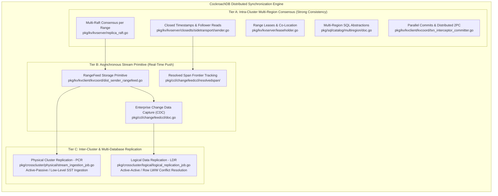

# CockroachDB Multi-Location & Multi-Database Synchronization: Reverse Engineering Architecture Plan

## 1. Executive Overview & Plan Scope

This directory constitutes the authoritative technical documentation library reverse-engineering how **CockroachDB** achieves resilient, distributed, multi-location and multi-database data synchronization. 

Distributed data synchronization in modern database engineering spans two fundamentally distinct problem domains:
1. **Intra-Cluster Multi-Location Synchronization**: Synchronizing data across nodes, racks, availability zones, and geographical regions within a single distributed SQL cluster while upholding serializable ACID guarantees, minimal WAN latency, and automated survivability.
2. **Inter-Cluster Multi-Database Synchronization**: Replicating data across independently managed database clusters or external systems, supporting both unidirectional disaster recovery mirroring (Active-Passive) and bi-directional multi-master collaboration (Active-Active) with deterministic conflict resolution.

This reverse engineering initiative is executed to inform the system architecture of **THKMesh** (GovTech Telehealth Kiosk Mesh), enabling edge kiosks, regional hospital hubs, and national health cloud databases to synchronize vital medical records across constrained, intermittent, and heterogeneous networks.

---

## 2. Synchronization Subsystems Classification & Taxonomy



---

## 3. Master Reverse Engineering Document Catalog (1-to-1 Sprint Mapping)

The following set of architectural documents maps 1-to-1 with the active sprint roadmaps in [`docs/sprints/_active/`](file:///Users/bkoo/Documents/Development/GovTech/THKMesh/cockroach/docs/sprints/_active/), accompanied by Mermaid sequence diagrams, state machines, comparative tables, and concrete source code references:

| Document | Sprint ID | Target Subsystem & Focus | Primary Code Anchors |
| :--- | :--- | :--- | :--- |
| [`00_master_synchronization_overview.md`](file:///Users/bkoo/Documents/Development/GovTech/THKMesh/cockroach/docs/reverse_engineering/00_master_synchronization_overview.md) | **Overview** | End-to-end architectural synthesis, cross-layer coordination, latency benchmarks, and consistency tradeoffs across all subsystems. | High-level engine synthesis |
| [`01_consensus_and_topology_foundations.md`](file:///Users/bkoo/Documents/Development/GovTech/THKMesh/cockroach/docs/reverse_engineering/01_consensus_and_topology_foundations.md) | **Sprint 01** | Multi-Raft per Range, Joint Consensus, Range Leases (Epoch vs Expiration), Hybrid Logical Clocks (HLC), and Gossip WAN discovery. | [`replica_raft.go`](file:///Users/bkoo/Documents/Development/GovTech/THKMesh/cockroach/pkg/kv/kvserver/replica_raft.go), [`leaseholder.go`](file:///Users/bkoo/Documents/Development/GovTech/THKMesh/cockroach/pkg/kv/kvserver/leaseholder.go), [`hlc.go`](file:///Users/bkoo/Documents/Development/GovTech/THKMesh/cockroach/pkg/util/hlc/hlc.go), [`gossip.go`](file:///Users/bkoo/Documents/Development/GovTech/THKMesh/cockroach/pkg/gossip/gossip.go) |
| [`02_multi_region_sql_and_placement.md`](file:///Users/bkoo/Documents/Development/GovTech/THKMesh/cockroach/docs/reverse_engineering/02_multi_region_sql_and_placement.md) | **Sprint 02** | Multi-Region SQL catalog, `REGIONAL BY TABLE`, `REGIONAL BY ROW`, `GLOBAL TABLES`, zone config synthesis, and Allocator constraint scoring. | [`region_config.go`](file:///Users/bkoo/Documents/Development/GovTech/THKMesh/cockroach/pkg/sql/catalog/multiregion/region_config.go), [`allocator.go`](file:///Users/bkoo/Documents/Development/GovTech/THKMesh/cockroach/pkg/kv/kvserver/allocator/allocatorimpl/allocator.go) |
| [`03_wan_latency_and_follower_reads.md`](file:///Users/bkoo/Documents/Development/GovTech/THKMesh/cockroach/docs/reverse_engineering/03_wan_latency_and_follower_reads.md) | **Sprint 03** | Closed Timestamps, out-of-band side-transport network, bounded staleness, local reads from distant followers, and zero-WAN read latency. | [`sidetransport/sender.go`](file:///Users/bkoo/Documents/Development/GovTech/THKMesh/cockroach/pkg/kv/kvserver/closedts/sidetransport/sender.go), [`receiver.go`](file:///Users/bkoo/Documents/Development/GovTech/THKMesh/cockroach/pkg/kv/kvserver/closedts/sidetransport/receiver.go) |
| [`04_distributed_transactions_and_parallel_commits.md`](file:///Users/bkoo/Documents/Development/GovTech/THKMesh/cockroach/docs/reverse_engineering/04_distributed_transactions_and_parallel_commits.md) | **Sprint 04** | Distributed 2PC coordination, Transaction Interceptors stack, in-flight write pipelining, 1-RTT Parallel Commits (`STAGING` state), and Concurrency Manager. | [`txn_coord_sender.go`](file:///Users/bkoo/Documents/Development/GovTech/THKMesh/cockroach/pkg/kv/kvclient/kvcoord/txn_coord_sender.go), [`txn_interceptor_committer.go`](file:///Users/bkoo/Documents/Development/GovTech/THKMesh/cockroach/pkg/kv/kvclient/kvcoord/txn_interceptor_committer.go), [`concurrency_manager.go`](file:///Users/bkoo/Documents/Development/GovTech/THKMesh/cockroach/pkg/kv/kvserver/concurrency/concurrency_manager.go) |
| [`05_changefeeds_and_rangefeeds.md`](file:///Users/bkoo/Documents/Development/GovTech/THKMesh/cockroach/docs/reverse_engineering/05_changefeeds_and_rangefeeds.md) | **Sprint 05** | RangeFeed low-level storage push primitive, resolved span frontiers, durable checkpoints, and enterprise multi-sink streaming. | [`dist_sender_rangefeed.go`](file:///Users/bkoo/Documents/Development/GovTech/THKMesh/cockroach/pkg/kv/kvclient/kvcoord/dist_sender_rangefeed.go), [`pkg/ccl/changefeedccl`](file:///Users/bkoo/Documents/Development/GovTech/THKMesh/cockroach/pkg/ccl/changefeedccl) |
| [`06_physical_cluster_replication_pcr.md`](file:///Users/bkoo/Documents/Development/GovTech/THKMesh/cockroach/docs/reverse_engineering/06_physical_cluster_replication_pcr.md) | **Sprint 06** | Physical Cluster Replication (PCR), byte-level stream ingestion, pull-based consumption, `ReplicatedTime` frontier tracking, and standby cutover. | [`stream_ingestion_job.go`](file:///Users/bkoo/Documents/Development/GovTech/THKMesh/cockroach/pkg/crosscluster/physical/stream_ingestion_job.go), [`pkg/crosscluster/producer/`](file:///Users/bkoo/Documents/Development/GovTech/THKMesh/cockroach/pkg/crosscluster/producer/) |
| [`07_logical_data_replication_ldr.md`](file:///Users/bkoo/Documents/Development/GovTech/THKMesh/cockroach/docs/reverse_engineering/07_logical_data_replication_ldr.md) | **Sprint 07** | Active-Active multi-master replication, Last-Write-Wins (LWW) conflict resolution using MVCC origin timestamps, transaction dependency scheduler, and DLQ. | [`lww_row_processor.go`](file:///Users/bkoo/Documents/Development/GovTech/THKMesh/cockroach/pkg/crosscluster/logical/lww_row_processor.go), [`scheduler.go`](file:///Users/bkoo/Documents/Development/GovTech/THKMesh/cockroach/pkg/crosscluster/logical/txnscheduler/scheduler.go) |
| [`08_thkmesh_mesh_synchronization_blueprint.md`](file:///Users/bkoo/Documents/Development/GovTech/THKMesh/cockroach/docs/reverse_engineering/08_thkmesh_mesh_synchronization_blueprint.md) | **Sprint 08** | Complete architectural synthesis adapting CockroachDB into GovTech THKMesh: edge kiosk offline resilience, hub-and-spoke sync, LWW/CRDT conflict resolution, and mesh consensus. | Synthesis for GovTech THKMesh |

---

## 4. Cross-Cutting Engineering Dimensions

Every document in this reverse engineering repository evaluates the targeted subsystem against five non-negotiable distributed systems criteria:

```
+---------------------------------------------------------------------------------------+
|                              DISTRIBUTED SYSTEMS AUDIT CRITERIA                        |
+---------------------------------------------------------------------------------------+
| 1. CONSISTENCY MODEL    | Linearizability, Serializability, Causal, Bounded Staleness |
| 2. LATENCY CHARACTERISTICS | 0-RTT Local, 1-RTT Quorum, Cross-Region WAN Round-Trips    |
| 3. PARTITION RESILIENCE | Majority Quorum, Pull-Based Resumption, Offline Autonomy    |
| 4. RECOVERY SEMANTICS   | Durable Checkpoints, Frontier High-Watermarks, Replay Safety |
| 5. RESOURCE FOOTPRINT   | Bandwidth Efficiency, Memory Quotas, Storage Engine Pacing   |
+---------------------------------------------------------------------------------------+
```

---

## 5. Active Sprint Coordination

Execution of this reverse engineering plan is coordinated with the active sprints residing in [`docs/sprints/_active/`](file:///Users/bkoo/Documents/Development/GovTech/THKMesh/cockroach/docs/sprints/_active/):
- **Sprint 01-04**: Deep-dives into Intra-Cluster Consensus, Multi-Region Topologies, Closed Timestamps, and Distributed Transactions.
- **Sprint 05-07**: Deep-dives into Real-Time CDC, Physical Cluster Replication, and Logical Active-Active Replication.
- **Sprint 08**: Formal synthesis and architecture blueprinting for THKMesh.
