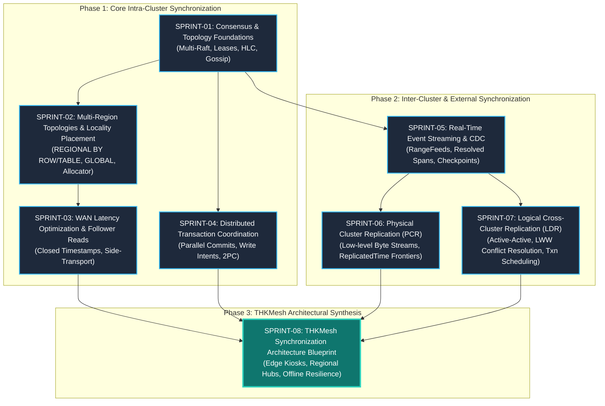

# Active Sprints: CockroachDB Multi-Location & Multi-Database Synchronization Reverse Engineering & THKMesh Adaptation

## 1. Executive Summary & Orchestration

This directory contains the active execution sprints for systematically studying, reverse-engineering, and adapting CockroachDB's distributed data synchronization subsystems. The ultimate objective is to extract its proven synchronization paradigms—ranging from intra-cluster multi-region consensus to inter-cluster physical and logical replication—and synthesize an architecture blueprint for **THKMesh** (GovTech Telehealth Kiosk Mesh), enabling resilient multi-location, multi-database synchronization across edge kiosks, regional hospital hubs, and central cloud databases.

### Architectural Leads & Review Roles
- **Winston (System Architect)**: System-level protocol decomposition, distributed systems correctness proofs, multi-cluster topology synthesis, and THKMesh architecture blueprinting.
- **Amelia (Senior Software Engineer)**: Concrete codebase inspection, code reference mapping (`file://` anchors), unit/integration test harness analysis, and implementation feasibility verification.

---

## 2. Sprint Roadmap & Dependency Graph

---

## 3. Sprint Directory & Core Themes

| Sprint ID | Document | Core Theme & Subsystems | CockroachDB Code Anchors |
| :--- | :--- | :--- | :--- |
| **SPRINT-01** | [`SPRINT-01-CONSENSUS-AND-TOPOLOGY-FOUNDATIONS.md`](file:///Users/bkoo/Documents/Development/GovTech/THKMesh/cockroach/docs/sprints/_active/SPRINT-01-CONSENSUS-AND-TOPOLOGY-FOUNDATIONS.md) | Multi-Raft per Range, Joint Consensus, Range Leases, HLC, and Gossip WAN topology discovery. | [`pkg/kv/kvserver/replica_raft.go`](file:///Users/bkoo/Documents/Development/GovTech/THKMesh/cockroach/pkg/kv/kvserver/replica_raft.go), [`pkg/util/hlc/hlc.go`](file:///Users/bkoo/Documents/Development/GovTech/THKMesh/cockroach/pkg/util/hlc/hlc.go), [`pkg/gossip/gossip.go`](file:///Users/bkoo/Documents/Development/GovTech/THKMesh/cockroach/pkg/gossip/gossip.go) |
| **SPRINT-02** | [`SPRINT-02-MULTI-REGION-LOCALITY-AND-PLACEMENT.md`](file:///Users/bkoo/Documents/Development/GovTech/THKMesh/cockroach/docs/sprints/_active/SPRINT-02-MULTI-REGION-LOCALITY-AND-PLACEMENT.md) | Multi-Region SQL catalog, table locality abstractions (`REGIONAL BY TABLE`, `REGIONAL BY ROW`, `GLOBAL`), and Allocator constraint satisfaction. | [`pkg/sql/catalog/multiregion/doc.go`](file:///Users/bkoo/Documents/Development/GovTech/THKMesh/cockroach/pkg/sql/catalog/multiregion/doc.go), [`pkg/ccl/multiregionccl/multiregion.go`](file:///Users/bkoo/Documents/Development/GovTech/THKMesh/cockroach/pkg/ccl/multiregionccl/multiregion.go), [`pkg/kv/kvserver/allocator/allocatorimpl/allocator.go`](file:///Users/bkoo/Documents/Development/GovTech/THKMesh/cockroach/pkg/kv/kvserver/allocator/allocatorimpl/allocator.go) |
| **SPRINT-03** | [`SPRINT-03-WAN-LATENCY-OPTIMIZATION-AND-FOLLOWER-READS.md`](file:///Users/bkoo/Documents/Development/GovTech/THKMesh/cockroach/docs/sprints/_active/SPRINT-03-WAN-LATENCY-OPTIMIZATION-AND-FOLLOWER-READS.md) | Closed Timestamps side-transport, bounded-staleness follower reads, and latency-aware lease migration. | [`pkg/kv/kvserver/closedts/sidetransport/sender.go`](file:///Users/bkoo/Documents/Development/GovTech/THKMesh/cockroach/pkg/kv/kvserver/closedts/sidetransport/sender.go), [`pkg/kv/kvserver/leaseholder.go`](file:///Users/bkoo/Documents/Development/GovTech/THKMesh/cockroach/pkg/kv/kvserver/leaseholder.go) |
| **SPRINT-04** | [`SPRINT-04-DISTRIBUTED-TRANSACTIONS-AND-PARALLEL-COMMITS.md`](file:///Users/bkoo/Documents/Development/GovTech/THKMesh/cockroach/docs/sprints/_active/SPRINT-04-DISTRIBUTED-TRANSACTIONS-AND-PARALLEL-COMMITS.md) | Distributed 2PC coordination, Transaction Interceptors, Write Intents, Parallel Commits (1 RTT commit), and Concurrency Manager. | [`pkg/kv/kvclient/kvcoord/txn_coord_sender.go`](file:///Users/bkoo/Documents/Development/GovTech/THKMesh/cockroach/pkg/kv/kvclient/kvcoord/txn_coord_sender.go), [`pkg/kv/kvserver/concurrency/concurrency_manager.go`](file:///Users/bkoo/Documents/Development/GovTech/THKMesh/cockroach/pkg/kv/kvserver/concurrency/concurrency_manager.go) |
| **SPRINT-05** | [`SPRINT-05-RANGEFEEDS-AND-CHANGE-DATA-CAPTURE.md`](file:///Users/bkoo/Documents/Development/GovTech/THKMesh/cockroach/docs/sprints/_active/SPRINT-05-RANGEFEEDS-AND-CHANGE-DATA-CAPTURE.md) | Core and Enterprise Changefeeds, RangeFeed push primitive, Resolved Spans high-watermark frontiers, durable checkpoints, and multi-sink streaming. | [`pkg/ccl/changefeedccl/doc.go`](file:///Users/bkoo/Documents/Development/GovTech/THKMesh/cockroach/pkg/ccl/changefeedccl/doc.go), [`pkg/kv/kvclient/kvcoord/dist_sender_rangefeed.go`](file:///Users/bkoo/Documents/Development/GovTech/THKMesh/cockroach/pkg/kv/kvclient/kvcoord/dist_sender_rangefeed.go) |
| **SPRINT-06** | [`SPRINT-06-PHYSICAL-CLUSTER-REPLICATION-PCR.md`](file:///Users/bkoo/Documents/Development/GovTech/THKMesh/cockroach/docs/sprints/_active/SPRINT-06-PHYSICAL-CLUSTER-REPLICATION-PCR.md) | Physical Cluster Replication (PCR), byte-level stream ingestion, ReplicatedTime frontier tracking, standby read timestamps, and fast disaster recovery. | [`pkg/crosscluster/physical/stream_ingestion_job.go`](file:///Users/bkoo/Documents/Development/GovTech/THKMesh/cockroach/pkg/crosscluster/physical/stream_ingestion_job.go), [`pkg/crosscluster/producer/replication_manager.go`](file:///Users/bkoo/Documents/Development/GovTech/THKMesh/cockroach/pkg/crosscluster/producer/replication_manager.go) |
| **SPRINT-07** | [`SPRINT-07-LOGICAL-CROSS-CLUSTER-REPLICATION-LDR.md`](file:///Users/bkoo/Documents/Development/GovTech/THKMesh/cockroach/docs/sprints/_active/SPRINT-07-LOGICAL-CROSS-CLUSTER-REPLICATION-LDR.md) | Active-Active Cross-Cluster Replication (LDR), Last-Write-Wins (LWW) conflict resolution via MVCC origin timestamps, transaction dependency scheduler, and DLQ. | [`pkg/crosscluster/logical/lww_row_processor.go`](file:///Users/bkoo/Documents/Development/GovTech/THKMesh/cockroach/pkg/crosscluster/logical/lww_row_processor.go), [`pkg/crosscluster/logical/txnscheduler/scheduler.go`](file:///Users/bkoo/Documents/Development/GovTech/THKMesh/cockroach/pkg/crosscluster/logical/txnscheduler/scheduler.go) |
| **SPRINT-08** | [`SPRINT-08-THKMESH-SYNCHRONIZATION-BLUEPRINT.md`](file:///Users/bkoo/Documents/Development/GovTech/THKMesh/cockroach/docs/sprints/_active/SPRINT-08-THKMESH-SYNCHRONIZATION-BLUEPRINT.md) | Architectural synthesis adapting CockroachDB principles into THKMesh: edge kiosk offline resilience, hub-and-spoke sync, LWW/CRDT conflict resolution, and mesh consensus. | Synthesizes reverse engineering findings into THKMesh implementation plans. |

---

## 4. Definition of Done (DoD) for Each Sprint

To graduate an active sprint, the following artifacts and criteria must be satisfied:
1. **Source Code Line Tracing**: Every conceptual mechanism must be directly mapped to exact Go source files, interfaces, structs, and methods with `file://` markdown hyperlinks.
2. **Mermaid Visualizations**: Detailed sequence diagrams, component block diagrams, state transition machines, and data-flow pipelines depicting the synchronization mechanics.
3. **Comparative Analysis Matrices**: Structured markdown tables comparing latency, throughput, consistency guarantees, network requirements, and failure resilience.
4. **THKMesh Applicability Section**: Explicit mapping of CockroachDB's enterprise algorithms to the GovTech Telehealth Kiosk Mesh constraints (intermittent cellular connectivity, constrained edge compute, multi-tenant patient medical records, zero data-loss requirement).
5. **Reverse Engineering Document Plan Execution**: The corresponding detailed reverse engineering document under [`docs/reverse_engineering/`](file:///Users/bkoo/Documents/Development/GovTech/THKMesh/cockroach/docs/reverse_engineering/) is drafted, cross-referenced, and reviewed.
