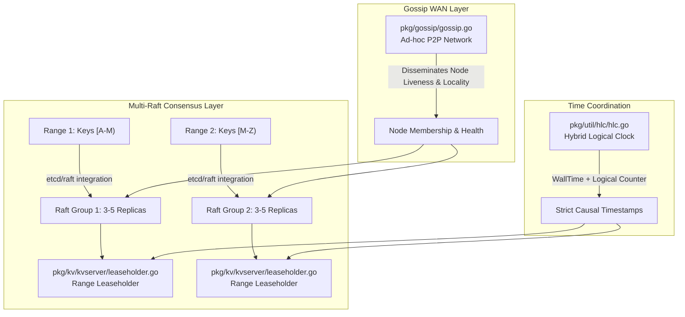
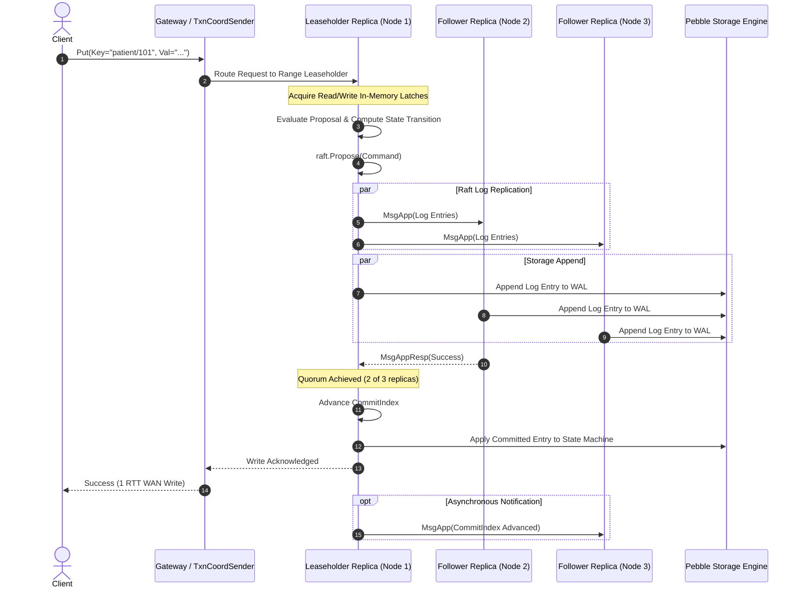

# Sprint 01: Consensus & Topology Foundations (Multi-Raft, Leases, HLC, and Gossip)

## 1. Executive Summary & Vision
- **Objective**: Reverse engineer CockroachDB's foundational intra-cluster synchronization layer. This layer ensures that distributed nodes across heterogeneous network failure domains and geographic regions maintain strong consistency, causal ordering, and decentralized cluster membership without centralized coordination.
- **Architectural Leads**:
  - **Winston (System Architect)**: Multi-Raft scalability analysis, Hybrid Logical Clock (HLC) causality bounds, epoch-based Range Lease correctness, and WAN partition survivability.
  - **Amelia (Senior Software Engineer)**: Concrete trace of `replica_raft.go`, `hlc.go`, and `gossip.go`, verifying proposal evaluation, heartbeat coalescing, and membership transitions.

---

## 2. Core Architectural Subsystems & Code Anchors

CockroachDB organizes data into continuous 64MB (or 512MB) key-value spans called **Ranges**. Each Range is an independent consensus group replicated across nodes:

### Key Source Code Anchors
1. **Multi-Raft Replica State Machine**: [`pkg/kv/kvserver/replica_raft.go`](file:///Users/bkoo/Documents/Development/GovTech/THKMesh/cockroach/pkg/kv/kvserver/replica_raft.go)
   - Evaluates commands, manages pending proposal quotas, batches messages, and steps through raft ready states (`handleRaftReady`).
   - Coalesces heartbeats across thousands of co-located ranges via [`maybeCoalesceHeartbeat`](file:///Users/bkoo/Documents/Development/GovTech/THKMesh/cockroach/pkg/kv/kvserver/replica_raft.go).
2. **Range Leaseholder Coordination**: [`pkg/kv/kvserver/leaseholder.go`](file:///Users/bkoo/Documents/Development/GovTech/THKMesh/cockroach/pkg/kv/kvserver/leaseholder.go) and [`pkg/kv/kvserver/replica_lease.go`](file:///Users/bkoo/Documents/Development/GovTech/THKMesh/cockroach/pkg/kv/kvserver/replica_lease.go)
   - Manages epoch and expiration leases. All client reads and writes target the Leaseholder to avoid quorum read round-trips.
3. **Hybrid Logical Clocks (HLC)**: [`pkg/util/hlc/hlc.go`](file:///Users/bkoo/Documents/Development/GovTech/THKMesh/cockroach/pkg/util/hlc/hlc.go)
   - Provides monotonically increasing timestamps $L = \langle \text{physical}, \text{logical} \rangle$. Enforces `max_offset` bounds to prevent causality anomalies.
4. **Gossip Protocol**: [`pkg/gossip/gossip.go`](file:///Users/bkoo/Documents/Development/GovTech/THKMesh/cockroach/pkg/gossip/gossip.go)
   - Decentralized information routing using ad-hoc peer networks with periodic entropy reduction.

---

## 3. Consensus Synchronization Lifecycle

---

## 4. Architectural Comparison: Synchronization Primitives

| Mechanism | Purpose in Synchronization | Network Overhead | Consistency Guarantee | Failure Mode |
| :--- | :--- | :--- | :--- | :--- |
| **Multi-Raft Consensus** | Durable write log ordering across replicas. | 1 Quorum RTT to majority of replicas. | Strict Serializable / Linearizable. | Stalls writes if majority of replicas are unreachable. |
| **Range Lease** | Single-replica read/write authority for a key span. | 0 RTT for reads; leases renewed via Raft proposal. | Prevents split-brain; isolates stale leaders. | Lease transfer takes timeout period if holder crashes. |
| **Hybrid Logical Clock (HLC)** | Distributed causal ordering without GPS/atomic clocks. | Zero network overhead (piggybacks on RPC metadata). | Causal consistency within bounded clock offset (`max_offset`). | Node terminates if physical clock drift exceeds `max_offset`. |
| **Gossip Network** | Peer discovery, liveness, and network topology maps. | $O(N \log N)$ periodic gossip exchange. | Eventual consistency ($< 2$ seconds convergence). | Partitions lead to stale routing tables; safe fallbacks. |

---

## 5. Reverse Engineering Findings for THKMesh

1. **Multi-Raft Partitioning**: THKMesh cannot run a single monolithic consensus group across hundreds of edge kiosks. It should adopt CockroachDB's range-partitioned Multi-Raft model, assigning independent consensus groups per healthcare clinic or geographical sub-zone.
2. **Epoch Leases over Expiration Leases**: For edge kiosks subject to intermittent network dropouts, time-based expiration leases cause frequent read stalls. CockroachDB's epoch leases tied to node liveness provide a robust pattern for edge stability.
3. **Bounded Clock Uncertainty**: Medical prescription and vitals timestamping require strict causality. Adopting CockroachDB's HLC model with software NTP synchronization guarantees deterministic conflict resolution at the edge.

---

## 6. Sprint Epics & Story Breakdown

### Epic 1: Multi-Raft Protocol Dissection
- **Story 1.1**: Trace `evalAndPropose` and proposal queuing in [`pkg/kv/kvserver/replica_raft.go`](file:///Users/bkoo/Documents/Development/GovTech/THKMesh/cockroach/pkg/kv/kvserver/replica_raft.go#L30-L120).
- **Story 1.2**: Analyze heartbeat coalescing (`maybeCoalesceHeartbeat`) to evaluate CPU and network scaling across 10,000+ consensus groups.
- **Story 1.3**: Document catch-up snapshot streaming (`store_snapshot.go`) when an edge node reconnects after prolonged disconnection.

### Epic 2: Range Lease & Co-Location Mechanics
- **Story 2.1**: Map lease acquisition, extension, and transfer sequences in [`pkg/kv/kvserver/leaseholder.go`](file:///Users/bkoo/Documents/Development/GovTech/THKMesh/cockroach/pkg/kv/kvserver/leaseholder.go).
- **Story 2.2**: Document how leaseholder placement minimizes cross-region WAN hops.

### Epic 3: Gossip & Hybrid Logical Clock Deep Dive
- **Story 3.1**: Inspect `Clock.Update` and `maxOffset` enforcement in [`pkg/util/hlc/hlc.go`](file:///Users/bkoo/Documents/Development/GovTech/THKMesh/cockroach/pkg/util/hlc/hlc.go).
- **Story 3.2**: Analyze anti-entropy message exchange and failure detection in [`pkg/gossip/gossip.go`](file:///Users/bkoo/Documents/Development/GovTech/THKMesh/cockroach/pkg/gossip/gossip.go).
