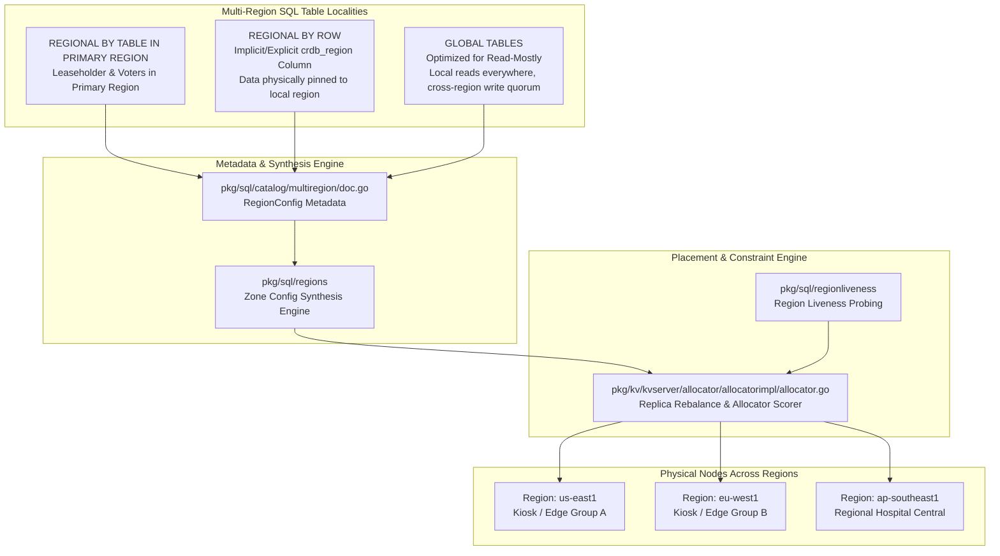
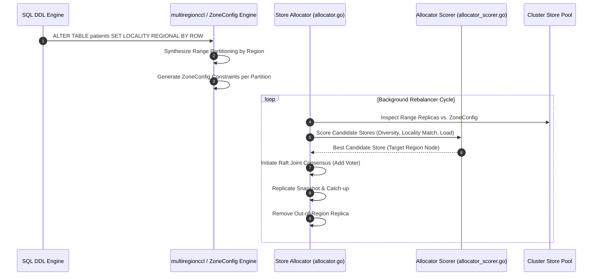

# Sprint 02: Multi-Region Topologies & Locality Placement (REGIONAL BY ROW/TABLE, GLOBAL, Allocator)

## 1. Executive Summary & Vision
- **Objective**: Reverse engineer CockroachDB's Multi-Region SQL abstraction and constraint-based replica placement engine. This architecture allows developers to define high-level regional data placement and survivability policies via declarative SQL commands (`REGIONAL BY TABLE`, `REGIONAL BY ROW`, `GLOBAL`), while the Allocator automatically solves complex multi-objective placement constraints across regions, zones, and data centers.
- **Architectural Leads**:
  - **Winston (System Architect)**: Topology models for regional partitioning, WAN latency tradeoffs, survivability goal semantics (Zone vs. Region failure), and Allocator scoring functions.
  - **Amelia (Senior Software Engineer)**: Code exploration of `pkg/sql/catalog/multiregion`, `pkg/ccl/multiregionccl`, and `pkg/kv/kvserver/allocator/allocatorimpl`, tracing how declarative SQL transforms into Range zone configurations and physical replica allocations.

---

## 2. Multi-Region Table Localities Architecture

### Key Source Code Anchors
1. **Multi-Region Catalog Abstraction**: [`pkg/sql/catalog/multiregion/doc.go`](file:///Users/bkoo/Documents/Development/GovTech/THKMesh/cockroach/pkg/sql/catalog/multiregion/doc.go) & [`pkg/sql/catalog/multiregion/region_config.go`](file:///Users/bkoo/Documents/Development/GovTech/THKMesh/cockroach/pkg/sql/catalog/multiregion/region_config.go)
   - Defines `RegionConfig`, the read-only struct capturing primary/secondary regions, survival goals, and placement policies.
2. **Multi-Region Initialization & DDL Execution**: [`pkg/ccl/multiregionccl/multiregion.go`](file:///Users/bkoo/Documents/Development/GovTech/THKMesh/cockroach/pkg/ccl/multiregionccl/multiregion.go)
   - Implements `initializeMultiRegionMetadata`, translating user-defined SQL survival goals into concrete schema changes.
3. **Replica Allocator & Constraint Scorer**: [`pkg/kv/kvserver/allocator/allocatorimpl/allocator.go`](file:///Users/bkoo/Documents/Development/GovTech/THKMesh/cockroach/pkg/kv/kvserver/allocator/allocatorimpl/allocator.go#L626) & [`pkg/kv/kvserver/allocator/allocatorimpl/allocator_scorer.go`](file:///Users/bkoo/Documents/Development/GovTech/THKMesh/cockroach/pkg/kv/kvserver/allocator/allocatorimpl/allocator_scorer.go)
   - Evaluates store diversity scores, disk capacity, and locality hierarchy matches (`region=us-east,zone=us-east-1a`) to decide replica additions, removals, and lease transfers.

---

## 3. Data Locality Comparison Matrix

| Locality Pattern | Read Latency | Write Latency | Range Partitioning Scheme | Primary Use Case in THKMesh |
| :--- | :--- | :--- | :--- | :--- |
| **REGIONAL BY TABLE** | Local in primary region ($<2$ms); WAN hop from non-primary regions ($50$-$150$ms). | Local in primary region ($<5$ms); WAN RTT from remote regions. | Entire table belongs to a single set of ranges located in the primary region. | Centralized configurations, clinical specialist directories, global system audit logs. |
| **REGIONAL BY ROW** | Local in row's home region ($<2$ms) across all distributed locations. | Local in row's home region ($<5$ms); zero WAN round-trips for local mutations. | Table ranges are partitioned by hidden or explicit `crdb_region` column. Ranges reside where rows belong. | Patient health records, kiosk sensor sessions, locally generated consultation notes. |
| **GLOBAL TABLES** | Local in **all** regions ($<2$ms) without reading over WAN. | Higher latency ($100$-$300$ms); requires write consensus across multiple regions. | Shared ranges with non-voting or voting replicas distributed globally; uses extended closed timestamps. | National drug formularies, ICD-10 medical diagnostic codes, reference lookup tables. |

---

## 4. Allocator Constraint Satisfaction Flow

---

## 5. THKMesh Engineering Relevance & Practical Translation

1. **Patient Data Locality (`REGIONAL BY ROW`)**: In Singapore/Regional telehealth deployments, data sovereignty and latency mandate that patient records created in a specific clinic or polyclinic reside locally on the regional hub. CockroachDB's `REGIONAL BY ROW` pattern provides an exact model for automated data sharding by location without application-level routing hacks.
2. **Medical Formularies (`GLOBAL TABLES`)**: Kiosks need instant offline-capable access to drug and triage rules. Emulating CockroachDB's `GLOBAL TABLES` allows read operations to be completely decoupled from WAN round-trips.
3. **Hierarchical Locality Strings**: THKMesh nodes should adopt CockroachDB's tier-based locality tagging format: `--locality=country=sg,cluster=north,hub=khoo-teck-puat,kiosk=k-104`, enabling multi-level constraint solving for edge synchronization.

---

## 6. Sprint Epics & Story Breakdown

### Epic 1: Catalog & Zone Config Synthesis Reverse Engineering
- **Story 1.1**: Dissect `RegionConfig` struct in [`pkg/sql/catalog/multiregion/region_config.go`](file:///Users/bkoo/Documents/Development/GovTech/THKMesh/cockroach/pkg/sql/catalog/multiregion/region_config.go).
- **Story 1.2**: Trace zone config generation for `REGIONAL BY ROW` tables in `pkg/sql/regions/`.
- **Story 1.3**: Analyze `SURVIVE REGION FAILURE` quorum synthesis versus `SURVIVE ZONE FAILURE`.

### Epic 2: Allocator Constraint Solver Analysis
- **Story 2.1**: Map the multi-objective scoring formula in [`pkg/kv/kvserver/allocator/allocatorimpl/allocator_scorer.go`](file:///Users/bkoo/Documents/Development/GovTech/THKMesh/cockroach/pkg/kv/kvserver/allocator/allocatorimpl/allocator_scorer.go).
- **Story 2.2**: Inspect rebalancing throttling and admission control during cross-region data migrations.
