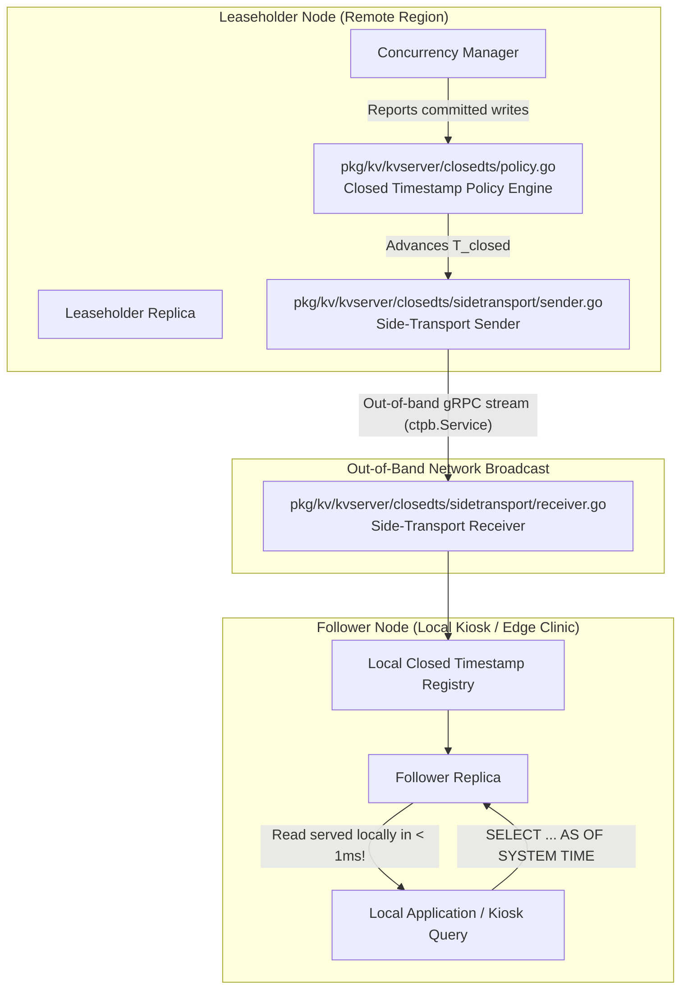
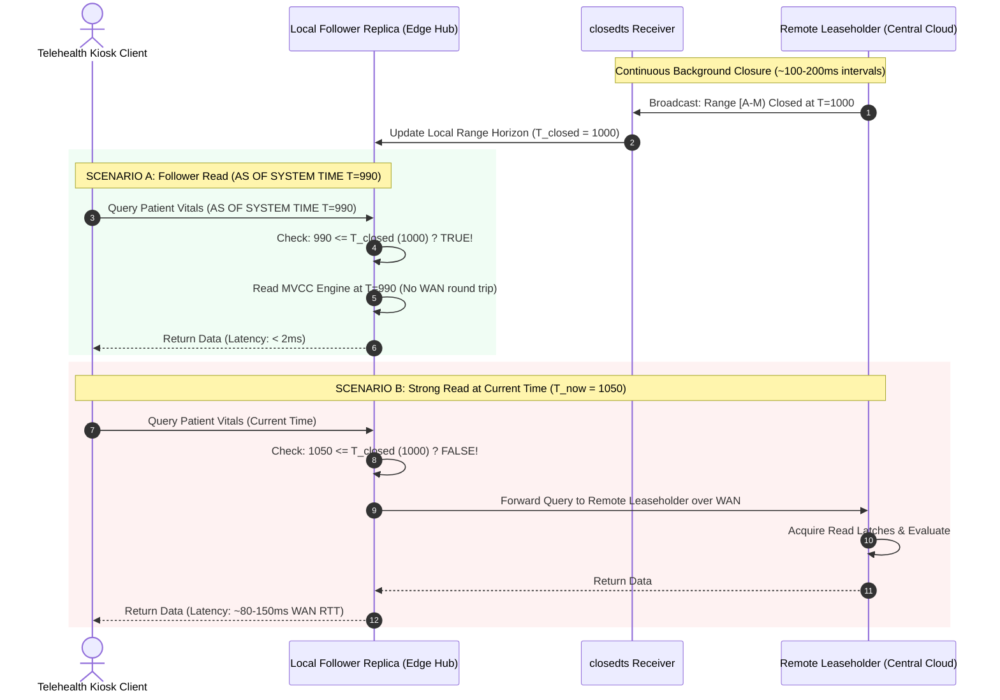

# Sprint 03: WAN Latency Optimization & Follower Reads (Closed Timestamps & Side-Transport)

## 1. Executive Summary & Vision
- **Objective**: Reverse engineer CockroachDB's breakthrough read latency optimization: **Closed Timestamps** and **Follower Reads**. In standard distributed consensus, serving consistent reads requires querying the Range Leaseholder (often across a high-latency WAN connection). CockroachDB eliminates this WAN penalty by continuously broadcasting closed timestamps out-of-band, allowing follower replicas in distant locations to serve read-only queries locally without communicating with the leaseholder.
- **Architectural Leads**:
  - **Winston (System Architect)**: Formal verification of closed timestamp monotonicity, bounded staleness models, side-transport RPC efficiency, and read-after-write consistency semantics.
  - **Amelia (Senior Software Engineer)**: Tracing `pkg/kv/kvserver/closedts`, `pkg/kv/kvserver/closedts/sidetransport/sender.go`, and `receiver.go`, detailing timestamp closure intervals and follower read execution paths.

---

## 2. Closed Timestamps & Side-Transport Architecture

### Key Source Code Anchors
1. **Side-Transport Sender**: [`pkg/kv/kvserver/closedts/sidetransport/sender.go`](file:///Users/bkoo/Documents/Development/GovTech/THKMesh/cockroach/pkg/kv/kvserver/closedts/sidetransport/sender.go)
   - Batches and transmits closed timestamp notifications to all cluster nodes over a low-overhead, dedicated gRPC stream.
2. **Side-Transport Receiver**: [`pkg/kv/kvserver/closedts/sidetransport/receiver.go`](file:///Users/bkoo/Documents/Development/GovTech/THKMesh/cockroach/pkg/kv/kvserver/closedts/sidetransport/receiver.go)
   - Ingests incoming closed timestamps into the local node's in-memory storage, enabling instant validation of follower read requests.
3. **Closed Timestamp Policy**: [`pkg/kv/kvserver/closedts/policy.go`](file:///Users/bkoo/Documents/Development/GovTech/THKMesh/cockroach/pkg/kv/kvserver/closedts/policy.go)
   - Computes target closed timestamp $T_{\text{closed}} = T_{\text{current}} - \text{target\_lag}$. Balances read freshness against write transaction conflict retries.
4. **Follower Read Routing**: [`pkg/kv/kvclient/kvcoord/dist_sender.go`](file:///Users/bkoo/Documents/Development/GovTech/THKMesh/cockroach/pkg/kv/kvclient/kvcoord/dist_sender.go)
   - Checks if a read request specifies `AS OF SYSTEM TIME` with a timestamp $\le T_{\text{closed}}$ for the targeted range; routes directly to the nearest follower replica.

---

## 3. Sequence: Follower Read vs. Traditional Leaseholder Read

---

## 4. Performance & Operational Trade-offs

| Dimension | Follower Read (`AS OF SYSTEM TIME`) | Standard Leaseholder Read |
| :--- | :--- | :--- |
| **Network Path** | Purely local LAN or on-device Unix socket. | Cross-region WAN round-trip to Leaseholder. |
| **Response Time** | $\mathbf{0.5 - 2 \text{ ms}}$ | $\mathbf{60 - 250 \text{ ms}}$ (governed by WAN fiber latency). |
| **Data Staleness** | Bounded staleness (typically $1 - 3$ seconds behind real-time). | Absolutely fresh (reflects latest committed transaction). |
| **WAN Partition Behavior** | **Fully available during network disconnection** (can read up to last closed timestamp). | **Unavailable** if WAN link to remote leaseholder drops. |
| **Impact on Primary Database** | Zero CPU or I/O load on the primary leaseholder. | Primary leaseholder must process and evaluate every read. |

---

## 5. THKMesh Telehealth Architecture Blueprint

1. **Edge Kiosk Read Resilience**: Telehealth kiosks querying patient historical vitals, previous consultation notes, and reference drug databases can execute all queries via Follower Reads. Even when cellular backhaul experiences transient outages, kiosk clinical workflows remain responsive.
2. **Side-Transport Push for Low Bandwidth**: CockroachDB's dedicated side-transport is remarkably bandwidth-efficient because it compresses closed timestamp intervals across ranges. In THKMesh, edge kiosks can subscribe to lightweight timestamp broadcasts over MQTT/gRPC.
3. **Automated Read-After-Write Safety**: When a patient updates their own questionnaire on a kiosk, that kiosk records the write's commit timestamp $T_{\text{commit}}$. Subsequent reads by the same patient query at $\ge T_{\text{commit}}$, providing monotonic read consistency without global locks.

---

## 6. Sprint Epics & Story Breakdown

### Epic 1: Closed Timestamp Side-Transport Reverse Engineering
- **Story 1.1**: Trace notification bundling in [`pkg/kv/kvserver/closedts/sidetransport/sender.go`](file:///Users/bkoo/Documents/Development/GovTech/THKMesh/cockroach/pkg/kv/kvserver/closedts/sidetransport/sender.go).
- **Story 1.2**: Inspect in-memory lookup structures in [`pkg/kv/kvserver/closedts/sidetransport/receiver.go`](file:///Users/bkoo/Documents/Development/GovTech/THKMesh/cockroach/pkg/kv/kvserver/closedts/sidetransport/receiver.go).

### Epic 2: Follower Read Execution Path Mapping
- **Story 2.1**: Map the DistSender decision tree for follower routing in [`pkg/kv/kvclient/kvcoord/dist_sender.go`](file:///Users/bkoo/Documents/Development/GovTech/THKMesh/cockroach/pkg/kv/kvclient/kvcoord/dist_sender.go).
- **Story 2.2**: Evaluate MVCC garbage collection interaction with closed timestamps (`GC threshold` retention).
