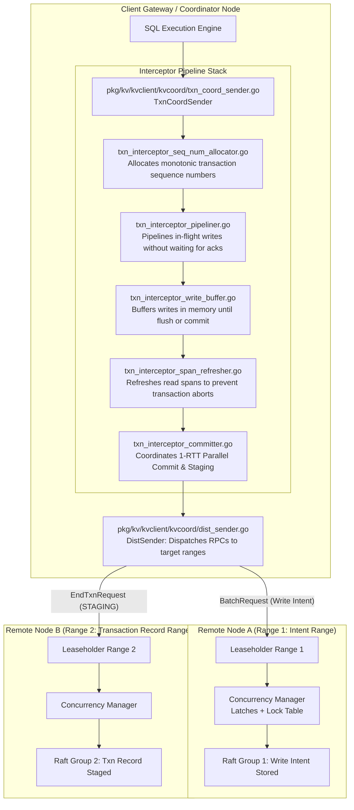
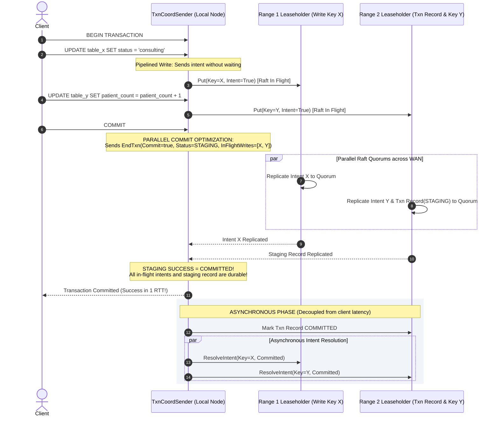

# Sprint 04: Distributed Transactions & Parallel Commits (2PC, Interceptors, Intents)

## 1. Executive Summary & Vision
- **Objective**: Reverse engineer CockroachDB's distributed transaction protocol. When a transaction spans multiple Ranges located on distinct physical nodes across geographically separated locations, CockroachDB executes distributed atomicity and serializability using an optimized Two-Phase Commit (2PC) protocol featuring **Parallel Commits**, inline **Write Intents**, and a layered **Transaction Interceptor Pipeline**. This reduces multi-region write latency from 2 Raft round-trips down to a single Raft round-trip.
- **Architectural Leads**:
  - **Winston (System Architect)**: Formal verification of Parallel Commit staging invariants, transaction record state transitions (`PENDING`, `STAGING`, `COMMITTED`, `ABORTED`), and asynchronous intent resolution.
  - **Amelia (Senior Software Engineer)**: Tracing the interceptor stack in `pkg/kv/kvclient/kvcoord`, specifically `txn_coord_sender.go`, `txn_interceptor_committer.go`, and the Concurrency Manager in `pkg/kv/kvserver/concurrency`.

---

## 2. Distributed Transaction Architecture & Interceptor Stack

### Key Source Code Anchors
1. **Transaction Coordinator**: [`pkg/kv/kvclient/kvcoord/txn_coord_sender.go`](file:///Users/bkoo/Documents/Development/GovTech/THKMesh/cockroach/pkg/kv/kvclient/kvcoord/txn_coord_sender.go)
   - Coordinates transaction state, heartbeats transaction records to keep them alive, and executes abort/commit lifecycles.
2. **Parallel Commit Interceptor**: [`pkg/kv/kvclient/kvcoord/txn_interceptor_committer.go`](file:///Users/bkoo/Documents/Development/GovTech/THKMesh/cockroach/pkg/kv/kvclient/kvcoord/txn_interceptor_committer.go)
   - Injects the list of all written spans into the `EndTxn` request, moving the transaction directly into the `STAGING` state.
3. **Write Pipelining Interceptor**: [`pkg/kv/kvclient/kvcoord/txn_interceptor_pipeliner.go`](file:///Users/bkoo/Documents/Development/GovTech/THKMesh/cockroach/pkg/kv/kvclient/kvcoord/txn_interceptor_pipeliner.go)
   - Allows multiple statements within a transaction to execute asynchronously without stalling for Raft consensus between statements.
4. **Concurrency Manager**: [`pkg/kv/kvserver/concurrency/concurrency_manager.go`](file:///Users/bkoo/Documents/Development/GovTech/THKMesh/cockroach/pkg/kv/kvserver/concurrency/concurrency_manager.go)
   - Unifies in-memory short-term latches with lock-table entries, managing conflicts between concurrent transactions across distributed nodes.

---

## 3. Parallel Commit Protocol Execution (1-RTT Commit)

---

## 4. Latency Analysis: Traditional 2PC vs. CockroachDB Parallel Commit

| Phase | Traditional Distributed 2PC | CockroachDB Parallel Commit | Latency Reduction |
| :--- | :--- | :--- | :--- |
| **Statement Execution** | Stalls on every statement until Raft quorum responds. | Pipelined asynchronously (`txn_interceptor_pipeliner.go`). | Overlaps statement round-trips. |
| **Prepare / Staging Phase** | 1 Raft RTT to write intents on all participant ranges. | In-flight intents and `STAGING` transaction record replicated in parallel. | Concurrent execution. |
| **Commit Phase** | 1 Raft RTT to update transaction record to `COMMITTED`. | **0 RTT to client**; Staged status proves commit atomically. | **Eliminates 1 entire WAN Raft RTT!** |
| **Total Client Latency** | $\mathbf{2 \times \text{WAN Raft RTT}}$ | $\mathbf{1 \times \text{WAN Raft RTT}}$ | **$50\%$ latency reduction across regions.** |

---

## 5. THKMesh Engineering Relevance & Translation

1. **Multi-Kiosk Cross-Range Atomicity**: When a patient checks in at Kiosk A, their appointment record in Table 1 and clinic queue slot in Table 2 must be updated atomically. Parallel Commits allow this distributed update across disparate regional nodes without high tail latency.
2. **Intent Resolution & Crash Recovery**: If a kiosk or edge node loses power during a consultation, lingering write intents are safely discovered by subsequent transactions. The transaction record's `STAGING` state deterministically resolves whether the write succeeded without human intervention.
3. **Decoupled Asynchronous Cleanup**: Edge mesh applications do not wait for background lock cleanup, maximizing user interface responsiveness for doctors and patients.

---

## 6. Sprint Epics & Story Breakdown

### Epic 1: Interceptor Pipeline Decompilation
- **Story 1.1**: Map execution ordering of all interceptors in [`pkg/kv/kvclient/kvcoord/txn_coord_sender.go`](file:///Users/bkoo/Documents/Development/GovTech/THKMesh/cockroach/pkg/kv/kvclient/kvcoord/txn_coord_sender.go).
- **Story 1.2**: Trace `txn_interceptor_committer.go` to analyze how `InFlightWrites` are tracked and validated.

### Epic 2: Parallel Commit State Machine & Recovery
- **Story 2.1**: Document the state machine transition from `PENDING` $\to$ `STAGING` $\to$ `COMMITTED`.
- **Story 2.2**: Inspect recovery rules when a coordinator crashes while a transaction is in `STAGING` state.
