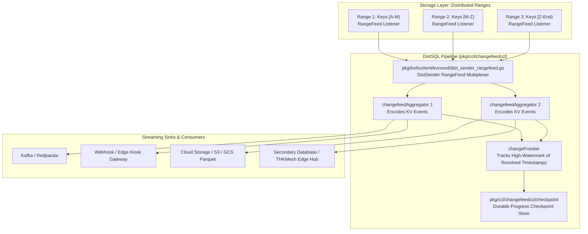
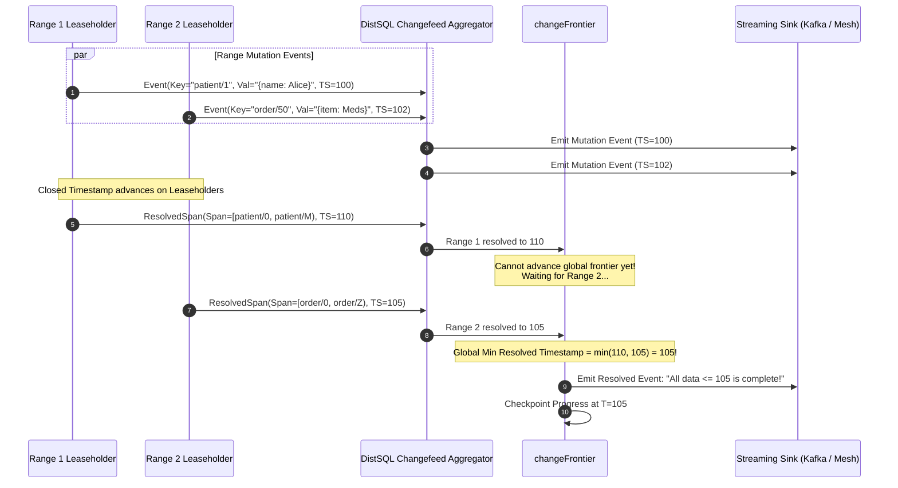

# Sprint 05: Real-Time Event Streaming & Change Data Capture (RangeFeeds, Resolved Spans, Checkpoints)

## 1. Executive Summary & Vision
- **Objective**: Reverse engineer CockroachDB's real-time event streaming and Change Data Capture (CDC) subsystem. Changefeeds stream table mutations continuously to external databases, message buses (Kafka, Cloud Pub/Sub), or secondary replicas. The core innovation is the **RangeFeed storage primitive** combined with **Resolved Spans (Frontiers)**, which guarantees cross-range and cross-database transactionally consistent snapshot progression without table locks or dual-write inconsistencies.
- **Architectural Leads**:
  - **Winston (System Architect)**: Formal analysis of Resolved Span progression, distributed frontier calculation, exactly-once checkpointing models, and backpressure mechanisms.
  - **Amelia (Senior Software Engineer)**: Source code analysis of `pkg/ccl/changefeedccl/doc.go`, `pkg/ccl/changefeedccl/changefeed_processors.go`, `checkpoint/`, and the low-level RangeFeed client in `pkg/kv/kvclient/kvcoord/dist_sender_rangefeed.go`.

---

## 2. Changefeed & RangeFeed Architecture

### Key Source Code Anchors
1. **Changefeed Architectural Contract**: [`pkg/ccl/changefeedccl/doc.go`](file:///Users/bkoo/Documents/Development/GovTech/THKMesh/cockroach/pkg/ccl/changefeedccl/doc.go)
   - Documents the interaction between `kvfeed`, `changefeedAggregator`, `changeFrontier`, and durable checkpointing.
2. **RangeFeed Client Multiplexer**: [`pkg/kv/kvclient/kvcoord/dist_sender_rangefeed.go`](file:///Users/bkoo/Documents/Development/GovTech/THKMesh/cockroach/pkg/kv/kvclient/kvcoord/dist_sender_rangefeed.go)
   - Opens persistent, streaming RPC connections to individual Range leaseholders; handles range splits, merges, and lease transfers transparently without dropping events.
3. **Changefeed Processors & Encoders**: [`pkg/ccl/changefeedccl/changefeed_processors.go`](file:///Users/bkoo/Documents/Development/GovTech/THKMesh/cockroach/pkg/ccl/changefeedccl/changefeed_processors.go) & [`encoder.go`](file:///Users/bkoo/Documents/Development/GovTech/THKMesh/cockroach/pkg/ccl/changefeedccl/encoder.go)
   - Encodes internal MVCC row mutations into standardized formats: JSON, Avro with Schema Registry, or Protobuf.
4. **Resolved Span Frontier Tracker**: [`pkg/ccl/changefeedccl/resolvedspan/`](file:///Users/bkoo/Documents/Development/GovTech/THKMesh/cockroach/pkg/ccl/changefeedccl/resolvedspan/)
   - Tracks the minimum resolved timestamp across all participating table ranges. Guarantees that no future mutation event with timestamp $\le T_{\text{resolved}}$ will ever be emitted.

---

## 3. The Resolved Span Protocol: Guaranteeing Consistency

---

## 4. Changefeed Delivery & Sink Guarantees

| Capability | CockroachDB Changefeeds | Traditional Dual-Write / Polling |
| :--- | :--- | :--- |
| **Consistency Guarantee** | Transactional consistency via Resolved Spans. | Vulnerable to race conditions and phantom reads. |
| **System Overhead** | Event push directly from memory/WAL in Pebble; no table locks. | Expensive SQL `SELECT * WHERE updated_at > ?` table scans. |
| **Resumption & Failover** | Automatic resumption from exact high-watermark checkpoint. | Risk of duplicate processing or skipped records on crash. |
| **Ordering Model** | Monotonic ordering per primary key; global order per resolved span. | Unpredictable ordering across multi-table updates. |
| **Schema Evolution** | Monitors catalog changes and encodes new schemas dynamically. | Breaks downstream consumers when schema changes. |

---

## 5. THKMesh Telehealth Architecture Blueprint

1. **Edge-to-Cloud Event Sync**: When a kiosk registers patient vital signs, CockroachDB's changefeed pattern allows those events to stream immediately to hospital backend queues without dual-write logic in the kiosk UI application.
2. **Resolved Timestamp Checkpoints for Edge Resumption**: In poor cellular reception areas, a kiosk may go offline for hours. Upon reconnecting, the kiosk presents its last acknowledged resolved timestamp ($T_{\text{resolved}}$); the upstream producer streams only the missing delta.
3. **Outbox Pattern Elimination**: Medical workflows typically use database outbox tables to trigger SMS or prescription dispatch. Changefeeds eliminate the outbox table pattern, converting the primary database tables directly into an event stream.

---

## 6. Sprint Epics & Story Breakdown

### Epic 1: RangeFeed Multiplexing & Connection Resiliency
- **Story 1.1**: Trace RangeFeed lifecycle during range splits in [`pkg/kv/kvclient/kvcoord/dist_sender_rangefeed.go`](file:///Users/bkoo/Documents/Development/GovTech/THKMesh/cockroach/pkg/kv/kvclient/kvcoord/dist_sender_rangefeed.go).
- **Story 1.2**: Inspect backpressure and memory quotas when downstream sinks slow down.

### Epic 2: Resolved Span Frontier & Checkpointing Engine
- **Story 2.1**: Map the math and data structures of `span.Frontier` under `pkg/ccl/changefeedccl/resolvedspan/`.
- **Story 2.2**: Analyze checkpoint persistence and recovery in [`pkg/ccl/changefeedccl/checkpoint/`](file:///Users/bkoo/Documents/Development/GovTech/THKMesh/cockroach/pkg/ccl/changefeedccl/checkpoint/).
