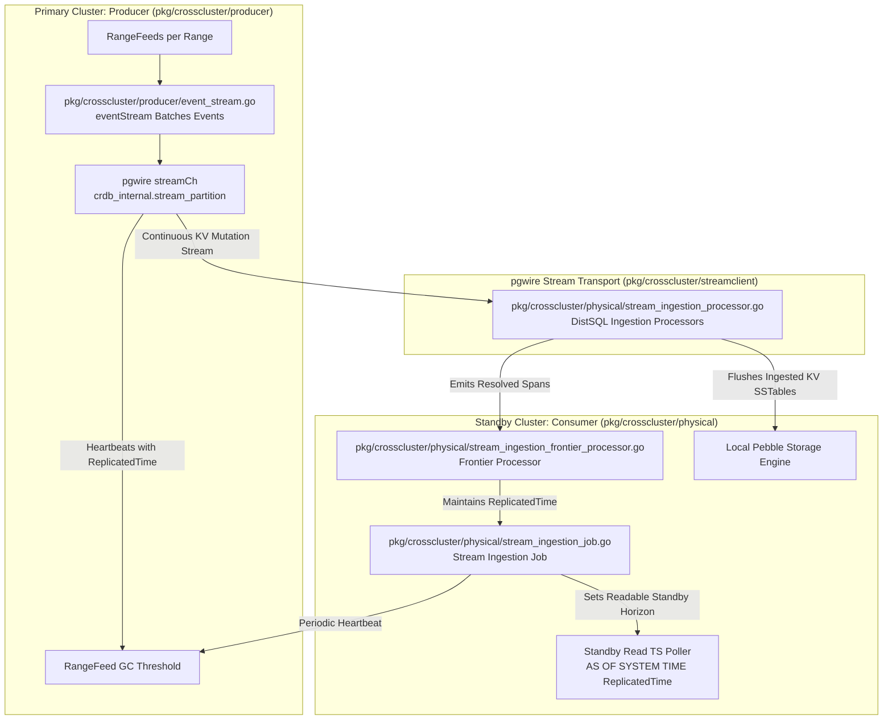
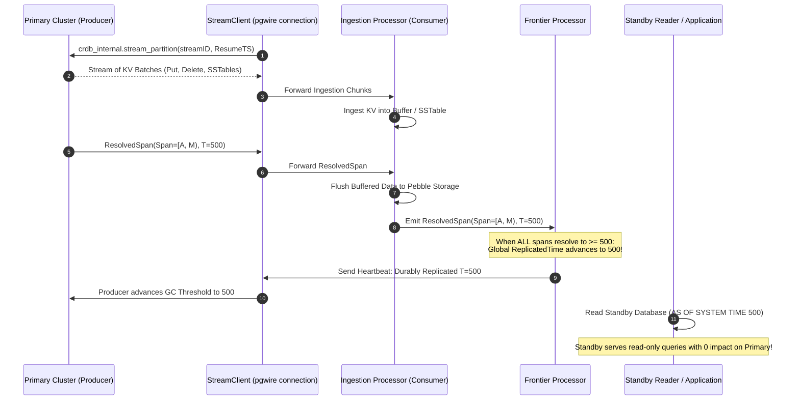

# Sprint 06: Physical Cluster Replication (PCR / Stream Ingestion & Standby Cutover)

## 1. Executive Summary & Vision
- **Objective**: Reverse engineer CockroachDB's **Physical Cluster Replication (PCR)** subsystem. PCR provides asynchronous, cross-cluster disaster recovery and continuous database synchronization at the physical Key-Value and Range layer. The destination cluster runs a pull-based stream ingestion job that connects to the primary cluster, consumes low-level KV mutation streams, tracks a durable `ReplicatedTime` frontier, and serves read-only queries at consistent standby timestamps with near-zero RPO and RTO.
- **Architectural Leads**:
  - **Winston (System Architect)**: Disaster recovery invariants, primary-standby cutover mechanics, garbage collection coordination via heartbeat thresholds, and replication lag backpressure.
  - **Amelia (Senior Software Engineer)**: Code exploration of `pkg/crosscluster/physical/stream_ingestion_job.go`, `stream_ingestion_processor.go`, `stream_ingestion_frontier_processor.go`, and the producer side in `pkg/crosscluster/producer/`.

---

## 2. PCR Multi-Cluster Architecture & Data Flow

### Key Source Code Anchors
1. **Physical Stream Ingestion Job**: [`pkg/crosscluster/physical/stream_ingestion_job.go`](file:///Users/bkoo/Documents/Development/GovTech/THKMesh/cockroach/pkg/crosscluster/physical/stream_ingestion_job.go)
   - Coordinates the distributed ingestion flow, tracks `ReplicatedTime` in job progress, and handles crash resumption from persisted checkpoints.
2. **Stream Ingestion Processor**: [`pkg/crosscluster/physical/stream_ingestion_processor.go`](file:///Users/bkoo/Documents/Development/GovTech/THKMesh/cockroach/pkg/crosscluster/physical/stream_ingestion_processor.go)
   - Ingests incoming batch chunks, formats raw KV bytes, executes bulk storage flushes into local Pebble SSTables, and tracks timing metrics (`AdmitLatency`, `FlushHistNanos`).
3. **Stream Ingestion Frontier Processor**: [`pkg/crosscluster/physical/stream_ingestion_frontier_processor.go`](file:///Users/bkoo/Documents/Development/GovTech/THKMesh/cockroach/pkg/crosscluster/physical/stream_ingestion_frontier_processor.go)
   - Aggregates resolved spans from all ingestion processors to maintain the global minimum frontier (`span.Frontier`).
4. **Producer Replication Manager**: [`pkg/crosscluster/producer/replication_manager.go`](file:///Users/bkoo/Documents/Development/GovTech/THKMesh/cockroach/pkg/crosscluster/producer/replication_manager.go) & [`event_stream.go`](file:///Users/bkoo/Documents/Development/GovTech/THKMesh/cockroach/pkg/crosscluster/producer/event_stream.go)
   - Exposes `crdb_internal.stream_partition` endpoint over pgwire, managing rangefeed subscriptions and protecting data from GC until acknowledged by consumer.

---

## 3. Physical Stream Ingestion Lifecycle & Checkpointing

---

## 4. PCR Operational Dynamics & Failure Modes

| Phase / Scenario | Mechanical Behavior | Invariant Maintained |
| :--- | :--- | :--- |
| **Normal Replication** | Producer streams mutations; Consumer flushes SSTables directly to Pebble; advances `ReplicatedTime`. | Sub-second replication lag ($RPO < 1\text{s}$). |
| **Consumer Node Crash** | Ingestion job restarts; reads persisted checkpoint `ReplicatedTime`; requests stream starting from `ReplicatedTime`. | Zero duplicate writes; exactly-once state recovery. |
| **Producer GC Protection** | Consumer heartbeats its `ReplicatedTime`; Producer pins MVCC garbage collection above that timestamp. | Prevents producer from purging historical versions needed by laggy consumer. |
| **Producer Cluster Outage (Failover)** | Administrator issues cutover command; Standby stops ingestion job and promotes database to read-write at `ReplicatedTime`. | Clean RTO ($< 5\text{s}$) with mathematically guaranteed snapshot consistency. |

---

## 5. THKMesh Telehealth Architecture Blueprint

1. **Regional Hospital DR Replica**: For tertiary medical institutions, CockroachDB's PCR pattern provides continuous, low-overhead database mirroring. A secondary hospital cluster can serve real-time analytics and read-only clinician dashboards without touching primary database resources.
2. **Direct Storage-Engine Ingestion**: PCR bypasses the SQL execution engine during replication, flushing directly as storage engine SSTables. For edge mesh hubs syncing high-volume physiological sensor telemetry, this direct ingestion provides $10\times$ the throughput of standard SQL inserts.
3. **Deterministic Cutover Verification**: When primary internet connectivity fails, edge medical teams can instantly promote their local standby database knowing the exact timestamp (`ReplicatedTime`) up to which data is intact.

---

## 6. Sprint Epics & Story Breakdown

### Epic 1: Producer RangeFeed & EventStream Mechanics
- **Story 1.1**: Trace `eventStream` batching and GC protection in [`pkg/crosscluster/producer/event_stream.go`](file:///Users/bkoo/Documents/Development/GovTech/THKMesh/cockroach/pkg/crosscluster/producer/event_stream.go).
- **Story 1.2**: Inspect connection establishment and resumption token passing via pgwire in [`pkg/crosscluster/streamclient/`](file:///Users/bkoo/Documents/Development/GovTech/THKMesh/cockroach/pkg/crosscluster/streamclient/).

### Epic 2: Ingestion Pipeline & Frontier Aggregation
- **Story 2.1**: Map the flush execution pipeline in [`pkg/crosscluster/physical/stream_ingestion_processor.go`](file:///Users/bkoo/Documents/Development/GovTech/THKMesh/cockroach/pkg/crosscluster/physical/stream_ingestion_processor.go).
- **Story 2.2**: Analyze `ReplicatedTime` advancement and Standby Read TS polling in [`pkg/crosscluster/physical/standby_read_ts_poller_job.go`](file:///Users/bkoo/Documents/Development/GovTech/THKMesh/cockroach/pkg/crosscluster/physical/standby_read_ts_poller_job.go).
