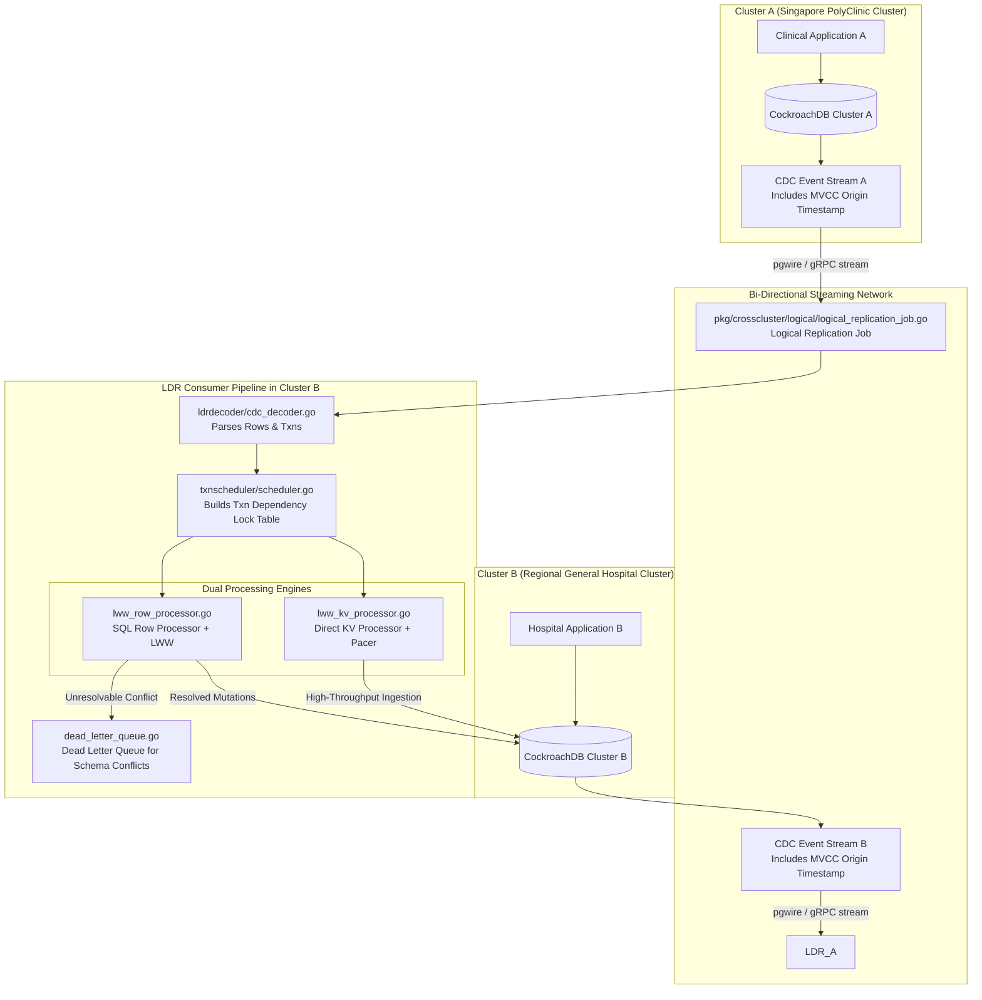
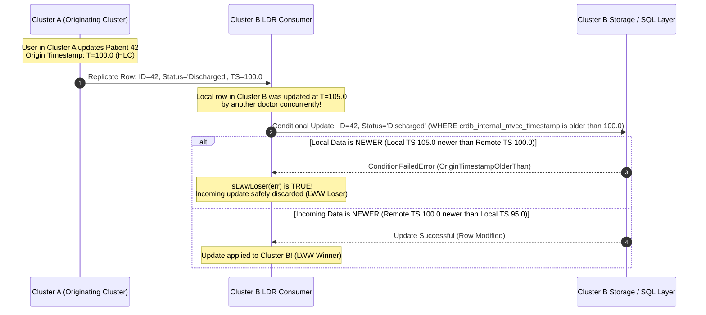

# Sprint 07: Logical Cross-Cluster Replication (LDR / Active-Active, LWW Conflict Resolution, and Txn Scheduling)

## 1. Executive Summary & Vision
- **Objective**: Reverse engineer CockroachDB's **Logical Data Replication (LDR)** architecture. Unlike PCR (which replicates physical key-value blocks unidirectionally from primary to standby), LDR operates at the logical SQL row and transaction layer. It enables **Active-Active, multi-master replication** across independently managed clusters. LDR solves the fundamental challenge of multi-master distributed systems: concurrent conflicting updates are automatically resolved via **Last-Write-Wins (LWW)** using MVCC origin timestamps, while a sophisticated **Transaction Dependency Scheduler** guarantees that causally related transactions are committed in exact causal order.
- **Architectural Leads**:
  - **Winston (System Architect)**: Multi-master conflict resolution models (LWW vs. CRDTs), causal dependency graph theory in `txnscheduler`, Dead Letter Queue (DLQ) isolation, and schema drift reconciliation.
  - **Amelia (Senior Software Engineer)**: Tracing `pkg/crosscluster/logical/lww_row_processor.go`, `lww_kv_processor.go`, `txnscheduler/scheduler.go`, and `txnapply/dependency_resolver.go`.

---

## 2. LDR Active-Active Cross-Cluster Architecture

### Key Source Code Anchors
1. **LWW Row Processor & Conflict Detection**: [`pkg/crosscluster/logical/lww_row_processor.go`](file:///Users/bkoo/Documents/Development/GovTech/THKMesh/cockroach/pkg/crosscluster/logical/lww_row_processor.go)
   - Evaluates row mutation timestamps. Detects `isLwwLoser` (where incoming row is older than local row) and `isInsertWinnerWithConflict` (where incoming row wins LWW but encounters key conflict).
   - Injects `crdb_internal_mvcc_timestamp` condition checks to make row updates conditionally atomic.
2. **Direct KV LWW Processor**: [`pkg/crosscluster/logical/lww_kv_processor.go`](file:///Users/bkoo/Documents/Development/GovTech/THKMesh/cockroach/pkg/crosscluster/logical/lww_kv_processor.go)
   - Bypasses SQL parsing and planner overhead for maximum throughput, applying LWW directly at the Key-Value level with CPU/admission pacing.
3. **Transaction Dependency Scheduler**: [`pkg/crosscluster/logical/txnscheduler/scheduler.go`](file:///Users/bkoo/Documents/Development/GovTech/THKMesh/cockroach/pkg/crosscluster/logical/txnscheduler/scheduler.go)
   - Maintains an in-memory lock table (tracking 1 write lock and up to 8 read locks per key hash). Transforms incoming transactions into a dependency DAG: `(dependent_transactions[], minimum_applied_time)`.
4. **Transaction Applier**: [`pkg/crosscluster/logical/txnapply/dependency_resolver.go`](file:///Users/bkoo/Documents/Development/GovTech/THKMesh/cockroach/pkg/crosscluster/logical/txnapply/dependency_resolver.go) & [`txn_applier.go`](file:///Users/bkoo/Documents/Development/GovTech/THKMesh/cockroach/pkg/crosscluster/logical/txnapply/txn_applier.go)
   - Applies concurrent transactions in parallel workers, stalling only when a strict causal lock dependency exists.
5. **Dead Letter Queue (DLQ)**: [`pkg/crosscluster/logical/dead_letter_queue.go`](file:///Users/bkoo/Documents/Development/GovTech/THKMesh/cockroach/pkg/crosscluster/logical/dead_letter_queue.go)
   - Safely diverts unresolvable row mutations (e.g., foreign key violations or schema mismatch) to a quarantine table without blocking the replication stream.

---

## 3. LWW Conflict Resolution & Condition Checking

---

## 4. Architectural Comparison: PCR vs. LDR

| Feature / Metric | Physical Cluster Replication (PCR) | Logical Data Replication (LDR) |
| :--- | :--- | :--- |
| **Replication Layer** | Physical Key-Value and Pebble Range blocks. | Logical SQL rows, column values, and transactions. |
| **Topology Support** | Primary $\to$ Standby (Active-Passive). | Active-Active (Multi-Master bi-directional replication). |
| **Conflict Resolution** | None needed (Standby is strictly read-only). | **Last-Write-Wins (LWW)** using MVCC origin timestamps. |
| **Schema Flexibility** | Destination must be byte-for-byte identical. | Supports heterogeneous schemas, partial tables, and column subsets. |
| **Causal Ordering** | Guaranteed by RangeFeed physical frontier. | Guaranteed by `txnscheduler` lock table dependency graph. |
| **Target Workload** | Full cluster Disaster Recovery & read offloading. | Multi-location multi-database collaboration with local write autonomy. |

---

## 5. THKMesh Telehealth Architecture Blueprint

1. **Active-Active Healthcare Clinics**: A patient might consult a general practitioner at Clinic A in the morning and visit Specialist Clinic B in the afternoon. With LDR, both clinic databases accept writes locally with zero WAN latency. When connectivity synchronizes the clusters, CockroachDB's LWW algorithm resolves updates deterministically.
2. **Transaction Causal Dependency Graph**: A prescription transaction must never be applied before the diagnosis transaction that created it. The `txnscheduler` lock table dependency algorithm provides the exact blueprint for THKMesh to maintain medical causal ordering across asynchronous mesh links.
3. **Dead Letter Queue for Medical Audits**: In medical compliance, silent data loss is illegal. If a replicated row violates a local clinical constraint, LDR's DLQ preserves the rejected mutation with full metadata for clinical review.

---

## 6. Sprint Epics & Story Breakdown

### Epic 1: LWW Conflict Resolution Engine
- **Story 1.1**: Trace condition check construction in [`pkg/crosscluster/logical/lww_row_processor.go`](file:///Users/bkoo/Documents/Development/GovTech/THKMesh/cockroach/pkg/crosscluster/logical/lww_row_processor.go#L80-L150).
- **Story 1.2**: Contrast `sqlRowProcessor` with `kvRowProcessor` in [`lww_kv_processor.go`](file:///Users/bkoo/Documents/Development/GovTech/THKMesh/cockroach/pkg/crosscluster/logical/lww_kv_processor.go).

### Epic 2: Transaction Dependency Scheduling
- **Story 2.1**: Decompile lock table tracking in [`pkg/crosscluster/logical/txnscheduler/scheduler.go`](file:///Users/bkoo/Documents/Development/GovTech/THKMesh/cockroach/pkg/crosscluster/logical/txnscheduler/scheduler.go).
- **Story 2.2**: Map concurrent worker dispatching in [`pkg/crosscluster/logical/txnapply/dependency_resolver.go`](file:///Users/bkoo/Documents/Development/GovTech/THKMesh/cockroach/pkg/crosscluster/logical/txnapply/dependency_resolver.go).
