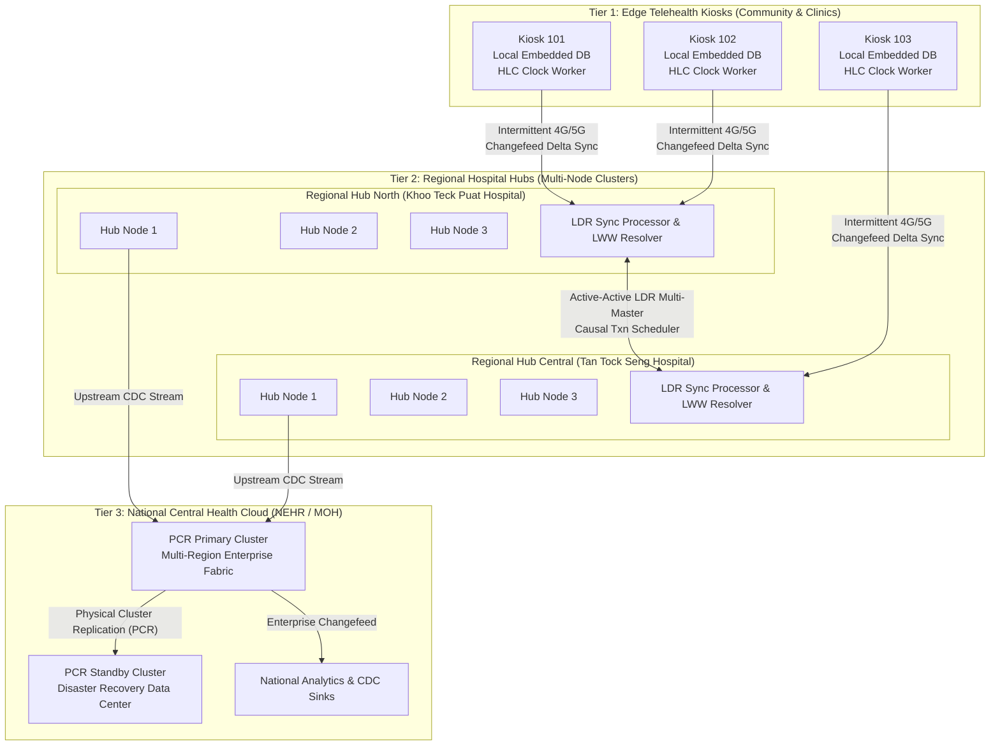
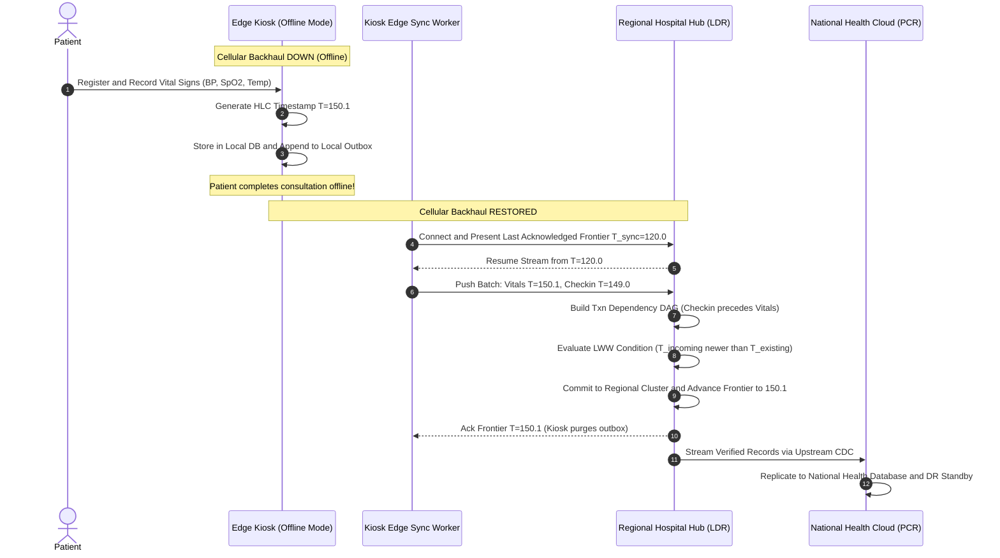

# Sprint 08: THKMesh Synchronization Architecture Blueprint (Edge Kiosks, Regional Hubs, and Central Cloud)

## 1. Executive Summary & Vision
- **Objective**: Synthesize the reverse engineering findings from Sprints 01 through 07 into an authoritative, production-grade architectural blueprint for **THKMesh** (GovTech Telehealth Kiosk Mesh). This sprint bridges CockroachDB's distributed enterprise algorithms with the real-world operational realities of telehealth: edge kiosks operating over flaky 4G/5G cellular links, regional hospital hubs requiring low-latency clinical access, and central health databases requiring absolute regulatory compliance and zero data loss.
- **Architectural Leads**:
  - **Winston (System Architect)**: Multi-tier topology definition, edge-hub-cloud data flow mapping, conflict resolution matrix, and network partition failure modes.
  - **Amelia (Senior Software Engineer)**: Implementation specifications, edge-to-hub synchronization protocol, local SQLite/embedded sync worker design, and integration test strategy.

---

## 2. THKMesh Multi-Tier Synchronization Architecture

---

## 3. Adaptation of CockroachDB Synchronization Subsystems to THKMesh

| CockroachDB Subsystem | Core Enterprise Mechanism | THKMesh Edge/Hub Adaptation | Operational Benefit |
| :--- | :--- | :--- | :--- |
| **Hybrid Logical Clocks (HLC)** ([`hlc.go`](file:///Users/bkoo/Documents/Development/GovTech/THKMesh/cockroach/pkg/util/hlc/hlc.go)) | Physical wall time combined with logical causal counter; `max_offset` detection. | Kiosk clients generate HLC timestamps for all sensor readings, patient vitals, and nurse notes. | Preserves true medical causal ordering even if edge device system clock drifts by minutes. |
| **Logical Replication & LWW** ([`lww_row_processor.go`](file:///Users/bkoo/Documents/Development/GovTech/THKMesh/cockroach/pkg/crosscluster/logical/lww_row_processor.go)) | Conditional SQL update matching `crdb_internal_mvcc_timestamp`; `isLwwLoser` evaluation. | Edge hubs apply incoming kiosk batches conditionally; conflicts on patient profiles resolve deterministically. | Prevents stale offline edits from overwriting newer hospital updates upon reconnection. |
| **Transaction Scheduler** ([`scheduler.go`](file:///Users/bkoo/Documents/Development/GovTech/THKMesh/cockroach/pkg/crosscluster/logical/txnscheduler/scheduler.go)) | In-memory read/write lock table generating a dependency DAG `(dependent_txns[], min_time)`. | Hub sync workers apply offline kiosk transaction streams in parallel while respecting lock dependencies. | Maximum ingestion speed without violating relational foreign-key and causal integrity. |
| **Resolved Span Frontiers** ([`changefeedccl`](file:///Users/bkoo/Documents/Development/GovTech/THKMesh/cockroach/pkg/ccl/changefeedccl/doc.go)) | High-watermark timestamp tracking across distributed partitions; persistent checkpoints. | Kiosks maintain a persistent sync token ($T_{\text{resolved}}$); only unacknowledged records are uploaded. | Minimizes expensive cellular bandwidth and eliminates duplicate event processing. |
| **Closed Timestamps** ([`closedts`](file:///Users/bkoo/Documents/Development/GovTech/THKMesh/cockroach/pkg/kv/kvserver/closedts/sidetransport/sender.go)) | Side-transport broadcast of closed horizons; local follower reads. | Edge kiosks cache reference tables (drugs, clinics, staff) and serve instant local reads offline. | Kiosks remain 100% operational for patient registration and triage even during total network outages. |
| **Dead Letter Queue (DLQ)** ([`dead_letter_queue.go`](file:///Users/bkoo/Documents/Development/GovTech/THKMesh/cockroach/pkg/crosscluster/logical/dead_letter_queue.go)) | Diverts unresolvable row mutations to quarantine tables without blocking stream. | Conflicted medical mutations that fail automated reconciliation are safely stored in a review queue. | Zero silent data corruption; guarantees complete audit trail for clinical governance. |

---

## 4. End-to-End Edge-to-Cloud Data Flow

---

## 5. THKMesh Implementation Guidelines & Acceptance Criteria

1. **Deterministic Edge Timekeeping**: Edge kiosks must implement an HLC client library that tracks the local system wall clock and advances logical counters whenever an event is received from the hub.
2. **Schema Uniformity & Versioning**: All edge kiosk tables must include two internal metadata columns modeled on CockroachDB's internal schema:
   - `crdb_origin_timestamp`: Decimal representation of the HLC timestamp when the row was mutated.
   - `crdb_origin_node_id`: UUID of the originating kiosk or hub node.
3. **Partition-Tolerant Local Reads**: Kiosk user interfaces must read strictly against the local embedded replica using bounded-staleness queries, never executing blocking synchronous network RPCs in the critical UI thread.
4. **Automated Conflict Quarantine**: The regional hub must deploy an automated DLQ inspector that alerts clinic administrators if an edge mutation cannot be reconciled due to doctor-patient simultaneous edits.

---

## 6. Sprint Epics & Story Breakdown

### Epic 1: Edge Synchronization Client Library Design
- **Story 1.1**: Author the TypeScript / Go edge synchronization client modeled on `streamclient` and `dist_sender_rangefeed.go`.
- **Story 1.2**: Implement local outbox and durable checkpoint tracker storing $T_{\text{resolved}}$.

### Epic 2: Hub Ingestion & LWW Conflict Processor
- **Story 2.1**: Implement the conditional SQL update builder based on [`pkg/crosscluster/logical/lww_row_processor.go`](file:///Users/bkoo/Documents/Development/GovTech/THKMesh/cockroach/pkg/crosscluster/logical/lww_row_processor.go).
- **Story 2.2**: Implement the dependency lock scheduler modeled on [`pkg/crosscluster/logical/txnscheduler/scheduler.go`](file:///Users/bkoo/Documents/Development/GovTech/THKMesh/cockroach/pkg/crosscluster/logical/txnscheduler/scheduler.go).
